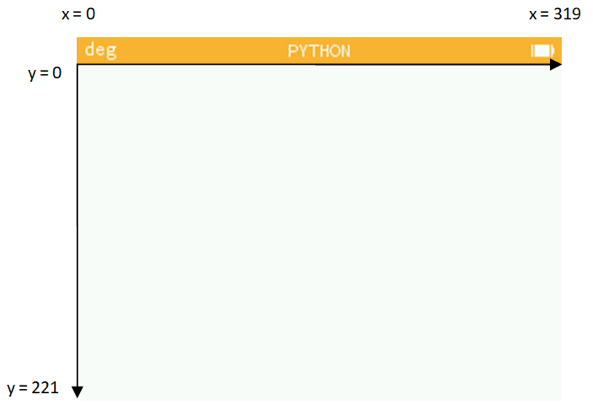
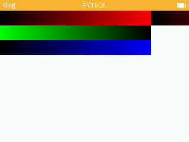
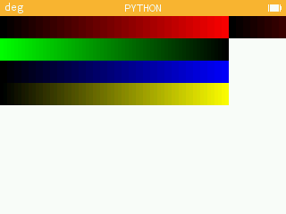
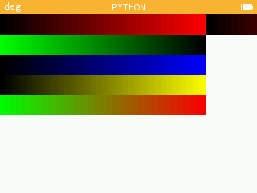
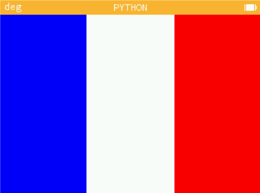

---
tags:
  - python
  - seconde
  - numworks
hide :
  - feedback
---
# TP : Le module kandinsky

!!! warning "TP pour Numworks"

!!! abstract "Objectifs" 
	Réaliser une image simple en agissant sur les trois composantes de ses pixels.
	

!!! info "Consignes"
	- Vous travaillerez et testerez vos scripts sur le site de la numworks dans l'onglet ```Mon site``` ou directement sur votre Pythonette.  
	- Créez vos scripts en prenant cochant [x] la case *Permettre aux autres utilisateurs d'accéder à ce script*. 
	- Sauvegarder les images obtenues à l'aide d'un click droit de souris.
	- Se connecter à la page [```Doctools```](https://link.dgpad.net/oMyz) l'aide des codes perso distribués. Utiliser le code ```oMyz``` pour accéder au document à compléter en ligne. Déposer les liens vers les scripts ansi que les images dans le document. 
	- Le nom du fichier indiquera la date et noms des élèves de votre groupe. 

 
## Introduction 

Cette séance[^1] vous permet d'utiliser des instructions Python pour modifier la structure d’une image numérique et le codage des pixels selon leurs composantes rouge, vert, bleu. 
On s’exercera à jouer avec les couleurs à l’écran et à effectuer des traitements simples sur l’image.  
 
!!! info "Préliminaires : le système Rouge, vert, bleu (RVB)"

	Le système RVB est un système de codage informatique des couleurs, qui indique comment reconstituer une couleur par synthèse additive à partir de trois couleurs primaires, un rouge, un vert et un bleu. Le codage RVB indique une valeur pour chacune de ces couleurs primaires.

	Une petite vidéo pour expliquer le monde étrange du RVB (les premières 8 min)

	<div>
	<iframe  width="100%" height="416px" src="https://www.youtube.com/embed/uYbdx4I7STg?rel=0&showinfo=0" frameborder="0" allow="accelerometer; autoplay; clipboard-write; encrypted-media; gyroscope; picture-in-picture" allowfullscreen></iframe>  
	</div>
  
  

## Module kandinsky

### Import 
Le module kandisky est chargé à l'inde d'une instruction ```#!python import``` :

```python linenums="1"
from kandinsky import * 
```
### Repère 

Le module Kandinsky utilise le repérage ci-dessous pour l'écran de la Numworks.   

 
### Codage des couleurs

On aura besoin ici de deux fonctions du module graphique ```kandinsky```, et les instructions :     

- ```set_pixel(x,y,color)``` : colore le pixel de coordonnées ```(x, y)``` de la couleur ```color```.  
- ```color(r,g,b)``` définit une couleur en fonction de ses composantes rouge, vert, bleu.
 
À partir de l’écran principal :
-  aller sur l’application Python (valider en appuyant sur Ok).  
- Faire défiler la page et ajoutez un script que l’on nommera ```couleurs.py``` (valider par Ok ).  
- Saisir ensuite le code suivant:
	```python linenums="1" title="couleurs.py"
	from kandinsky import *
	for y in range(25):
	  for x in range(320):
		col=color(x,0,0)
		set_pixel(x,y,col)
	```


## Prise en main 

### Question 1 
	Exécuter le script. Qu’observe-t-on ?

??? tip "Explications"

	```x``` désigne la position horizontale du point (abscisse), ```y``` sa position verticale (ordonnée)
	
	- ligne 1 : on importe les fonctions graphiques du module kandinsky
	- ligne 2 : on fait varier ```y``` de 0 à 24 (boucle principale du programme)
	- ligne 3 : on fait varier ```x``` de 0 à 319 (boucle secondaire du programme)
	- Pour chaque valeur de ```y``` et ```x```, on exécute les lignes 4 et 5 :
	
		- ligne 4 : on définit une couleur : ici l’intensité du rouge dépend de la position ```x```, l’intensité du vert et du bleu sont fixées à zéro.
		- ligne 5 : on donne au pixel courant la couleur que l’on vient de définir
 
	La couleur du point dépend donc de la position ```x```, d’où un dégradé sur la ligne horizontale ; on reproduit le tracé sur 25 lignes, d’où la création d’une bande horizontale de dégradé d’une hauteur de 25 lignes.

	On observe que le dégradé du noir vers le rouge s’étend sur les 4/5e de la largeur de l’écran, puis reprend à partir du noir.

	Dans l'instruction ```color(r,g,b)```, les paramètres r, g, b, sont des nombres entiers dont la valeur doit être comprise entre 0 et 255 : c'est dire qu'elle est codée sur **un octet**. 

??? tip "Indication : un octet"
	Un octet est un nombre binaire de 8 bits valant chacun 0 ou 1, ce qui donne 256 combinaisons possibles.	

	Par exemple, tapez dans la console ```bin(13)``` : la calculatrice affiche l’expression binaire (préfixe ```0b```) de 13 : ```00b10110```, on voit qu’il faut 4 bits pour coder en binaire le nombre 13 : ```1011```.   
	En effet  $13 = 1\times 8 + 0\times 4 + 1\times 2 + 1\times 1$.
 
 
### Question 2
  
Combien de bits sont nécessaires pour coder 255 et 256 en binaire ?  

??? tip "Indication"
	Pour répondre, tapez bin(255) et bin(256) et relevez les expressions binaires correspondantes.


### Question 3
 
Chaque point est défini par ses trois couleurs et chaque couleur étant codée sur un octet.
Calculer en octets, puis en ko (kilo-octets), la mémoire nécessaire pour coder, selon ce principe, l’ensemble des points de l’écran de la calculatrice.

### Question 4 

Editer le script ```couleurs``` et ajouter les lignes suivantes :

```python linenums="6" title="couleurs.py" 
for y in range(25,50):
	for x in range(256):
		col=color(0,255-x,0)
		set_pixel(x,y,col)
```
 
Exécutez le script et observez l’écran. Que fait ce morceau de programme ?


### Question 5
 
Expliquez le fonctionnement du programme en commentant chaque ligne.
 

### Question 6 
Compléter le programme pour créer une troisième bande de dégradé noir vers bleu et de longueur 256.



 

### Question 7 
  
Créer une quatrième bande de dégradé noir vers jaune : 
- le jaune correspond à une intensité égale du rouge et du vert ; le bleu est à 0.
 
 

 
### Question 8 
   
Créer une cinquième bande de dégradé vert vers rouge.

 
 

!!! info "Couleurs et numworks"
	En utilisant 1 octet pour chacune des composante r, v et b, on est capable de coder $256^3 \approx   16$ millions de couleurs. Pour autant les caracteristiques techniques de l'écran de la calculatrice ne permettent pas de distinguer autant de couleurs différentes.

   
## Drapeau

{width=20%, align=right}

L’objectif de cette partie est d’utiliser ses nouvelles connaissances pour dessiner le drapeau français.
  
Compléter et tester le script python ci-dessous afin de qu'il trace le drapeau tricolore.


```python linenums="1" title="drapeau.py" 
from kandinsky import *

# definition des couleurs (a completer):
bleu=color(..., ..., ...)
blanc=color(255,255,255)
rouge=color(..., ..., ...)

# pour toutes les lignes :
for y in range(222): # y varie de 0 à 221
	# partie gauche en bleu :
	for x in range(0,107): # premier tiers de la ligne
		set_pixel(x,y,bleu)
	# milieu en blanc :
	for x in range(108,215): # deuxieme tiers de la ligne
		# ...
```

 

 
## Nuances de gris 

 
### Question 9
   
1. Quelle est la couleur définie ```color(0,0,0)``` ?  
2. Quelle est la couleur définie ```color(255, 255, 255)``` ?   
3. En déduire comment définir un gris moyen. Testez. 

On veut écrire un programme permettant de partager l’écran en 10 bandes verticales de gris, allant du noir au blanc, le tout sur une hauteur de 100 pixels.

 
### Question 10

Quelle sera la largeur d’une bande ?
 
On veut que les intensités de gris soient bien réparties entre les valeurs extrêmes : ```color(0, 0, 0)``` et ```color(255, 255, 255)```. 

 
### Question 11

Quelle valeur faut-il ajouter au paramètre de couleur pour passer d’une bande à sa voisine ?
 
### Question 12


Saisir le script suivant en complétant la ligne 9:
```python linenums="1"
from kandinsky import *

# pour les 100 lignes du haut :
for y in range(100):
  # pour les 10 barres verticales:
  for b in range(10):
    # pour les 32 points horizontaux de chaque barre :
    for x in range(b*32,...):
      c=color(b*28,...,...)
      set_pixel(x,y,c)
```

### Question 13

Modifier la ligne 9 pour que le dégradé aille du blanc au noir en allant de gauche à droite. 

 
## Références

[^1]: Sujet original de Dominique Gluck professeur de SI pour la thématique photographie numérique.
 

