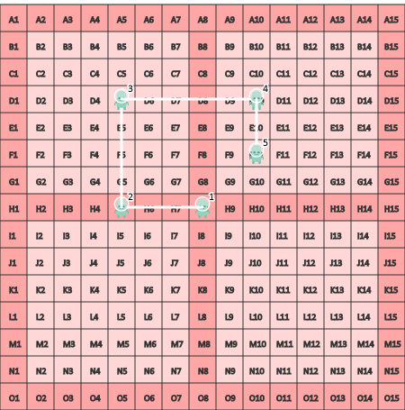
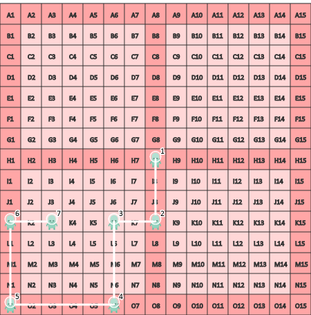

--- 
hide:
    - toc 
---
# Module Alien
 
!!!info "À partir du travail du groupe [Codex](https://codex.forge.apps.education.fr/exercices/alien_1/)"


 
???+ question "Question 1"
    ```python { .inline .end .w45 }
    gauche(3)
    haut(2)
    droite(7)
    ```
    {{ run('exo_1') }}
    {{ figure("figure1") }}

???+ question "Question 2"
    ```python { .inline .end .w45 }
    droite(6)
    bas(5)
    gauche(4)
    haut(3)
    droite(2)
    bas(1)
    ```
    {{ run('exo_2') }}
    {{ figure("figure2") }}

 
???+ question "Question 3"
    { align=right }

    {{ IDE('exo_3') }} 
    {{ figure("figure3",
            inner_text="En cas d'erreur, le parcours s'affichera ici", 
            admo_title="Tracé du parcours") }}

???+ question "Question 4"
    { align=right }

    {{ IDE('exo_4') }}
    {{ figure("figure4",
            inner_text="En cas d'erreur, le parcours s'affichera ici", 
            admo_title="Tracé du parcours") }}


## Références
 
[^1]: À partir du travail du [Codex](https://codex.forge.apps.education.fr/exercices/alien_1/)
