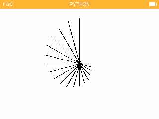

---
tags:
  - python
  - seconde 
hide :
  - feedback
---
# Le module turtle

!!! bug "la commande ```color()``` bugue"

!!! info "Consignes"
	- Vous travaillerez et testerez vos scripts sur le site de la numworks dans l'onglet ```Mon site``` ou directement sur votre Pythonette.  
	- Créez vos scripts en prenant cochant [x] la case *Permettre aux autres utilisateurs d'accéder à ce script*. 
	- Sauvegarder les images obtenues à l'aide d'un click droit de souris.
	- Se connecter à la page [```Doctools```](https://link.dgpad.net/ftK2) l'aide des codes perso distribués. Utiliser le code ```ftK2``` pour accéder au document à compléter en ligne. Déposer les liens vers les scripts ansi que les images dans le document. 
	- Le nom du fichier indiquera la date et noms des élèves de votre groupe. 


!!! info "Le module ```#!python turtle```"
	Le module ```!python turtle``` permet de tracer facilement des dessins en Python. Il s'agit de commander une tortue à l'aide d'instructions simples comme *avancer*, *tourner*...  
	C'est le même principe qu'avec **Scratch**, avec toutefois des différences : les instructions en anglais remplacent les blocs. 
	 
	Les points de l'écran sont détérminés par leurs coordonnées :
	
	- l'abscisse $x$ va de $-160$ à $+160$ 
	- l'ordonnée $y$ va de $-110$ à $+110$
	- $(0,0)$ est au centre de l'écran.
 
	


!!! info "Instructions de base du module"
 
	Nous nous contenterons d'utiliser les commandes disponibles dans le module ```turtle``` de la Numworks. 
	
	Pour les déplacements on utilise :
	
	-  ```forward(longueur)```  avance d'un certain nombre de pas
	-  ```backward(longueur)``` recule
	-  ```goto(x,y)```  se déplace jusqu'au point $(x,y)$
	-  ```position()```  renvoie la position $(x,y)$ de la tortue
	-  ```setposition(x,y)``` change la valeurs des coordonnées 
	-  ```right(angle)```  tourne vers la droite (sans avancer) selon un angle donné en degrés
	-  ```left(angle)``` tourne vers la gauche
	-  ```heading()``` renvoie la direction  ```angle``` vers laquelle pointe la tortue
	-  ```setheading(direction)``` s'oriente dans une direction ($0$ = droite, $90$ = haut, $-90$ = bas, $180$ = gauche)
	- ```circle(rayon)```  pour dessiner un cercle

	Pour régler les propriétés du stylo :
		
	-  ```down()``` / ```up()```  abaisse/relève le stylo 
	-  ```width(epaisseur)``` change l'épaisseur du trait
	-  ```color(rouge,vert, bleu)``` change la couleur du trait par synthès additive à partir de trois couleurs primaire. L'intensité de chaque couleur primaire est donnée par un entier entre ```0``` et ```255```.
	-  ```showturtle()``` et ```hideturtle()```
	- ```speed()``` vitesse de la tortue
 
!!! example "Exemple 1"
	
	Analyse ce [script](https://my.numworks.com/python/niz-moussatat/turtle_prof_tuto001_py) qui dessine la lettre J.
	
    {{ IDE('exemple01' ,MAX_SIZE=15, TERM_H=6) }}

	<div id="cible_1" class="admonition center" style="display: flex;justify-content: center;align-content:center;flex-direction: column;margin:auto;min-height:5em;text-align:center">
	Le  tracé sera affiché ici
	</div>


???+ question "Exercice 1" 

	Écrire un script qui trace vos initiales (2 lettres).
	
    {{ IDE('exercice01' ,MAX_SIZE=15, TERM_H=6) }}

	<div id="cible_11" class="admonition center" style="display: flex;justify-content: center;align-content:center;flex-direction: column;margin:auto;min-height:5em;text-align:center">
	Le  tracé sera affiché ici
	</div>
	
!!! example "Exemple 2"
	
	Tester le script ci-dessous.
	
    {{ IDE('exemple02' ,MAX_SIZE=15, TERM_H=6) }}

	<div id="cible_2" class="admonition center" style="display: flex;justify-content: center;align-content:center;flex-direction: column;margin:auto;min-height:5em;text-align:center">
	Le  tracé sera affiché ici
	</div>


???+ question "Exercice 2  Polygones réguliers"
	
	Ecrire un script d'une fonction d'appel ```octogone()``` qui prend pour paramètre ```l``` et dessine un octogone régulier de longueur de côté ```l```.
	 
	
    {{ IDE('exercice02' ,MAX_SIZE=15, TERM_H=6) }}

	<div id="cible_21" class="admonition center" style="display: flex;justify-content: center;align-content:center;flex-direction: column;margin:auto;min-height:5em;text-align:center">
	Le  tracé sera affiché ici
	</div>

!!! example "Exemple 3"
	
	Tester le script ci-dessous.
		
    {{ IDE('exemple03' ,MAX_SIZE=15, TERM_H=6) }}

	<div id="cible_3" class="admonition center" style="display: flex;justify-content: center;align-content:center;flex-direction: column;margin:auto;min-height:5em;text-align:center">
	Le  tracé sera affiché ici
	</div>
	


???+ question "Exercice 3 Une Spirale"
	
	Complèter le script ci-dessous afin de tracer la figure ci-dessous :
	
	.
	
    {{ IDE('exercice03' ,MAX_SIZE=15, TERM_H=6) }}
	 
	<div id="cible_31" class="admonition center" style="display: flex;justify-content: center;align-content:center;flex-direction: column;margin:auto;min-height:5em;text-align:center">
	Le  tracé sera affiché ici
	</div>
	 
!!! example "Exemple 4 Un peu de hasard"
	
	Tester le script ci-dessous.
			
    {{ IDE('exemple04' ,MAX_SIZE=18, TERM_H=6) }}

	<div id="cible_4" class="admonition center" style="display: flex;justify-content: center;align-content:center;flex-direction: column;margin:auto;min-height:5em;text-align:center">
	Le  tracé sera affiché ici
	</div>
	
	
???+ question "Exercice 4"
 
	1. Tester dans votre espace Numworks le script suivant. Enregistrer l'image dans le document. 
		```python linenums="1"
		from random import *
		from turtle import * 
		width(3)
		speed(0)
		def square(size):
			for i in range(4):
				forward(size)
				left(90)
		for i in range(20):
			x = randrange(-150,150)
			y = randrange(-50,50)
			up()
			goto(x,y)
			down()
			square(randrange(5,50))
		```
	 1. Modifier le script pour générer des carrés de traits de lignes variables, et de couleurs aléatoires.
 
 
 
