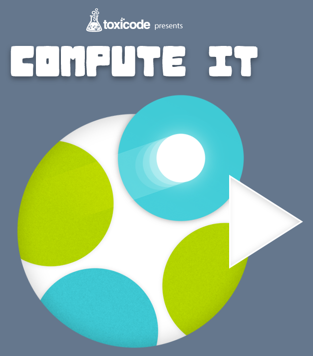
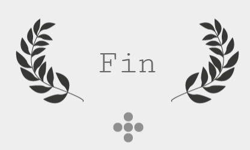

---
tags:
  - python/TD
  - seconde
hide :
  - feedback
---
#  Découvrir Python en 1h 

!!! info "Consignes"
 
	{width=25%, align=right}  
	 
	Pour cette fois, _vous_ endosserez le rôle d'interpréteur de code Python. Vous lirez et exécuterez le programme proposé pour trouver la bonne trajectoire et remporter les défis.
	
	Aucune connaissance préalable n'est exigée ! Pour ce début, l'assistance du professeur restera sous forme de simples indications.  
	Laissez votre intuition vous guider dans la compréhension de concepts fondamentaux en programmation.  
	
	Rendez-vous sur [COMPUTE-IT](https://compute-it.toxicode.fr/){ .md-button .md-button--primary  } et complétez les défits.
	
	_durée envisagée : environ 1h_

 
!!! abstract "Objectifs" 
	Au terme des défis proposés : 
	
	- vous comprendrez davantage la manière dont un ordinateur interprète un script.
	- vous serez plus rigoureux dans le respect de la syntaxe d'un script. 
	
	
??? success "Correspondances des défis avec concepts abordés par la suite" 

	{align=right, width=40%}
	
	1. Défis 5 à 11 : répétitions conditionnées ```#!python while``` 
	1. Défis 12 à  18 : répétitions finies ```#!python for```
	1. Défis 19 à  20 : instruction conditionnelles ```#!python if```
	1. Défis 21 à  46 : mélange
	1. Défis 47 à  57 : fonctions 
	1. Défis 58 à 62 : mélange avec de la récursivité ! [^1]
	
	[^1]: erreur dans 61, rajouter instruction ```droite()``` à la fin
	
		
	
