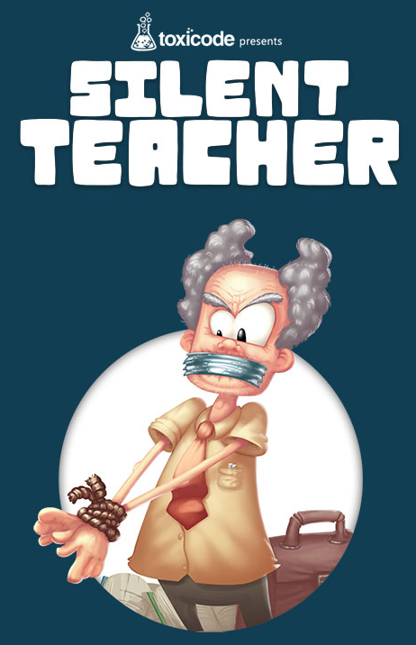

---
tags:
  - python/TD
  - seconde
hide :
  - feedback
---
# Silent teacher

## Les listes 


!!! coeur "Définition"
	Une liste est une structure de données qui contient une **collection ordonnée** d'objets Python. 
	 
	Une liste est composées d'éléments, séparés par des virgules et entourés par 2 crochets ```[ ]```.
	
	C'est un nouveau type d'objet (qui se rajoute aux entiers ```#!ptyhon int```, aux ```#!ptyhon float``` et chaines de caractères ```#!ptyhon str```).
	
	
!!! example "Exemple"
	
	Exécuter le script ci-dessous et noter que :
	
	- ```animaux``` est une liste de chaines de caractères.
	- ```tailles``` est une liste de floats.
	- Python autorise des listes contenant des valeurs de type différents comme ```mixte```
	- L'instruction ```#!python type()``` renvoie le type de l'objet.
	- L'instruction ```#!python len()``` renvoie la longueur de la liste.
	
	
    {{ IDE('exampleliste01', MAX_SIZE=10,  TERM_H=7) }}
	
!!! coeur "Liste : Indexation positive"
	On accède à un élément de la liste par son indice positif (ou ```index```)
	
	Une liste de $n$ éléments commence par l'élément d'indice $0$, et se termine par l'élément d'indice $n-1$ :
	
!!! example "Exemple "
	
	La liste ```animaux``` a 4 éléments, indexés de $0$ à $3$ :
	
	```py
	liste  : ["girafe", "tigre", "singe", "souris"]
	indice :        0        1        2         3
	```
	Il n'y a pas d'éléments d'indice 4 : ```animaux[4]``` renvoie une erreur.
	
    {{ IDE('exampleliste02', MAX_SIZE=10,  TERM_H=10) }}
	
## Entrainement
 

!!! abstract "Objectifs" 

	Au terme de l'activité _Silent Teacher_ vous aurez revus les notions du langage Python suivantes :
	
	- les variables, avec quelques listes
	- les instruction conditionnelles
	- les fonctions


!!! info "Consignes"
	 
	{width=25%, align=right}  
	
	Rendez-vous sur [SILENT-TEACHER](https://silentteacher.toxicode.fr/hour_of_code.html){ .md-button .md-button--primary  } 
	
	Endossez le rôle d'interpréteur de code Python  et déterminer la valeur renvoyée par l'instruction de la dernière ligne.
	 
	_durée envisagée : environ 1h_

	