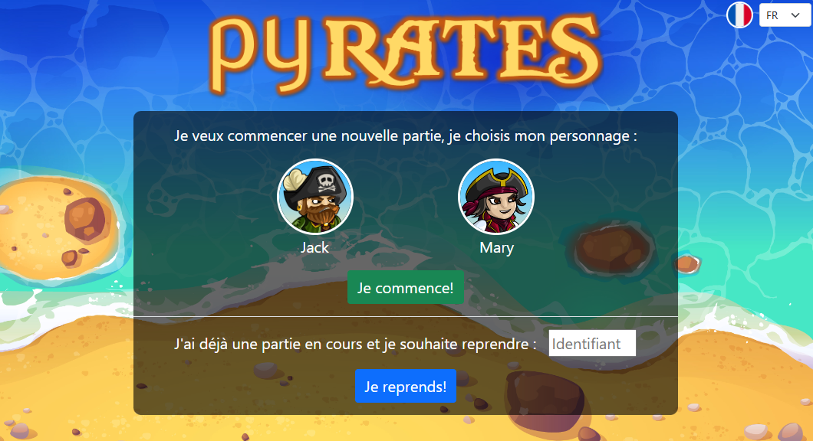

---
tags:
  - python/TD
  - seconde
hide :
  - feedback
---
# Jeu PYrates

{width=100%}

!!! abstract "Objectifs" 
	Mettre en application les notions abordées dans le parcours découverte.
	
	
!!! info "Consignes"

	Dans ce jeu vous aurez à compléter 8 niveau pour amener le personnage au niveau du trésor.
	
	- enregistrer sur un papier l'**identifiant de votre partie**. Il vous servira à reprendre une partie commencée ainsi que permettre au professeur de vérifier votre travail.
	- bien lire les contraintes à respecter pour réussir un niveau.
	
	Rendez-vous sur [py-rates.fr](https://py-rates.fr/){ .md-button .md-button--primary  }.
	
	_durée envisagée : environ 1h30_

 
	