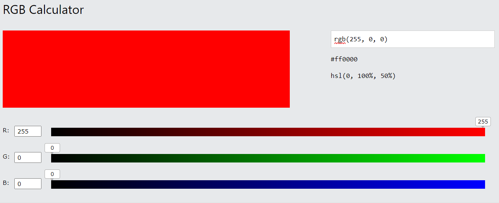

---
tags:
  - snt/codages
hide :
  - feedback
---
# Codage hexadécimal et utilisations
 
!!! abstract "Objectifs" 

	Système hexadécimal, et quelques utilisations.


!!! info "Consignes"

	- Continuez à compléter [```Doctools```](https://link.dgpad.net/r2FF){ .md-button .md-button--primary  } , se connecter à l'aide des codes perso distribués.
	- Utiliser le code ```r2FF``` pour accéder au document à compléter en ligne.   

 
## Le système hexadécimal

Le système hexadécimal est utilisé notamment en informatique car permet un compromis entre le code binaire des machines et une base de numération pratique à utiliser pour les ingénieurs. 

Il s'agit d'un système de numération en base 16. Il utilise donc 16 symboles, les chiffres arabes pour les dix premiers chiffres (0 à 9) et les lettres A (= 10 en décimal), B (= 11 en décimal) ... à F (= 15 en décimal) pour les six suivants.
  
<div class="grid" markdown>

| décimale | hexadécimale	 |	 binaire  |   
| :--: | :-----------: | :-----------:  |  
|   0|  ```0```	 |	 ```0000```   | 
|   1|  ```1```	 |	 ```0001```   | 
|   2|  ```2```	 |	 ```0010```   | 
|   3|  ```3```	 |	 ```0011```   | 
|   4|  ```4```	 |	 ```0100```   | 
|   5|  ```5```	 |	 ```0101```   | 
|   6|  ```6```	 |	 ```0110```   | 
|   7|  ```7```	 |	 ```0111```   |   


| décimale | hexadécimale	 |	 binaire  |   
| :--: | :-----------: | :-----------:  |   
|   8|  ```8```	 |	 ```1000```   | 
|   9|  ```9```	 |	 ```1001```   | 
|  10|  ```A```	 |	 ```1010```   | 
|  11|  ```B```	 |	 ```1011```   | 
|  12|  ```C```	 |	 ```1100```   | 
|  13|  ```D```	 |	 ```1101```   | 
|  14|  ```E```	 |	 ```1110```   | 
|  15|  ```F```	 |	 ```1111```   |   

</div>

!!! example "Exemple" 

 
	| Puissances de 16 | $16^{3}$	 	|	 $16^{2}$  | $16^{1}$   | $16^{0}$  |  
	|:--:|:-----------:|:-----------:|:-----------:|:-----------:|
	|  				   |		4096		|	 256  	   | 16 			| 1  |
	| $1237_{base 10}$ |   	 |	 4  | D | 5 |  
	
	$$4D5_\text{hex} = 4\times 16^{2} + 13\times 16^{1}+ 5\times 16^{0} = 1237_{base 10}$$

 
!!! tip  "Conversion binaire $\leftrightarrow$ hexadécimal"   
	
	Un octet, correspond à 8 bit, soit 2 chiffres dans l'écriture hexadécimale.
	
	1. Pour exprimer la valeur binaire ```101111100001```, on regroupe les bits par groupes de 4 : ```1011 1110 0001```.   
		D'après la table de conversion :
		
		- Les 4 premiers bits ```1011``` correspondent à $11$ soit donc $B$ en hexadécimal.
		- Les 4 bits suivants ```1110``` correspondent à $14$ soit donc $E$ en hexadécimal.
		- Les 4 derniers bits ```0001``` correspondent à $1$ soit donc $1$ en hexadécimal.

		L'écriture binaire ```101111100001``` correspond à ```BE1``` en hexadécimal.

	1. Inversement l'écriture hexadécimale ```21FD``` correspond à ```0010 0001 1111 1101```.
	 

	
???+ question "Exercice 8"  

	Complète le tableau ci-dessous. Les valeurs hexadécimales sont à 2 chiffres. Celles en binaires sont sur 1 octet.

	<div class="grid" markdown>

	| décimale | hexadécimale	 |	 binaire  |   
	| :--: | :-----------: | :-----------:  |  
	| ```0```   |  ```00```	 |	 ```0000 0000```   | 
	|    |  ```10```	 |	     | 
	|    |  ```B3```	 |	     |  
	|    |  ```6C```	 |	     |  
	 
	| décimale | hexadécimale	 |	 binaire  |   
	| :--: | :-----------: | :-----------:  |  
	|    |   	 |	 ```0011 1001```   | 
	|    |   	 |	 ```1111 0101```   | 
	|    |   	 |	 ```1010 1110```   |    
	|    |   	 |	 ```1111 1111```   |  
	  
	</div>

  
!!! info  "Point Python"

	Comme pour le binaire, on peut rentrer les nombres entiers directement en écriture hexadécimale à l'aide du préfixe ```0x```.

	Rentrer dans la console python ```0x6C``` et retrouver ses écritures décimales et binaires.
	
	{{ terminal(FILL='0x6C', TERM_H=4) }} 

## Le système RGB 

Le système RGB est un système de codage informatique des couleurs, qui indique comment reconstituer une couleur par synthèse additive à partir de trois couleurs primaires, un rouge (Red), un vert (Green) et un bleu (Blue). Le codage RGB indique une valeur pour chacune de ces couleurs primaires qui va de 0 à 255.

!!! example "Exemple" 
	Une couleur est donc identifiée par 3 octets (1 octet pour chaque couleur), ou 6 caractères hexadécimaux (2 pour chaque octet, précédés d'un #).

	Par exemple la couleur primaire rouge ci-dessous correspond à ```RGB(255,0,0)``` soit en hexadécimal ```#FF0000```.

	

???+ question "Exercice 9"  

	À l'aide du calculateur [W3schools RGB calculator](https://www.w3schools.com/colors/colors_rgb.asp){ .md-button .md-button--primary  } répondre aux questions suivantes :

	1. Quelle couleur correspond à ```RGB(255,255,0)```. Préciser son code hexadécimal.
	1. Quelle couleur correspond à ```RGB(255,255,255)```. Préciser son code hexadécimal.
	1. Donner le code ```RGB``` et hexadécimal associés au noir.
	1. Sur la page [Color picker](https://www.w3schools.com/colors/colors_picker.asp) vous pouvez retrouver les codes ```RGB``` en choisissant une couleur. Donner un code hexadécimal correspondant à un violet (plusieurs réponses possibles). 
	1. Combien de couleurs différentes peut-on coder avec le système RGB ?  (3 octets = 24 bits)


## Application : les adresses MAC

Une **adresse MAC** est un identifiant physique qui sert dans la plupart des systèmes réseaux qu'ils soient filaires (Ethernet, ATM...) ou sans fil (Bluetooth, Wi-Fi,...). Tout objet capable de communiquer sur un réseau a une adresse MAC. Des objets avec plusieurs périphériques réseau auront plusieurs adresses MAC associées à chaque périphérique du réseau. Imprimantes, PC, routeurs Ethernet ou wifi ont tous une adresse MAC.  

!!! example "Exemple" 
	Une adresse MAC est constituée de **48 bits ( 6  octets )** que l'on représente en 6  groupes de 2 chiffres hexadécimaux :  ``` NN:NN:NN:DD:DD:DD``` :

	- La première moitié indique le fabriquant de la carte réseau. 
	- La seconde moitié indique le numéro de série de la carte. 

	Ainsi ```00:1C:B3:4F:25:FE``` est une carte de réseau fabriquée par Apple. 
 

???+ question "Exercice 10"   

	Retrouver l'adresse MAC du périphérique wifi de votre téléphone.  Joindre une capture d'écran pour le point complet.

???+ question "Exercice bonus : travail de recherche (article en anglais)" 

	Les adresses MAC peuvent servir à **identifier un appareil**. Depuis juillet 2019, **Transport for London** récolte les données Wi-Fi des utilisateurs du métro londonien.

	À l'aide de la page officielle [Transport for London](https://tfl.gov.uk/corporate/privacy-and-cookies/wi-fi-data-collection){ .md-button .md-button--primary  } expliquer :

	1. La signification de _Wi-Fi connection data_ (lire le paragraphe *What Wi-Fi connection data is*)
	1. Les objectifs d'une telle récolte de données (lire paragraphe *Why TfL is doing this*)
	1. Le(s) action(s) à faire pour ne pas être pisté lors d'un passage dans le métro de Londres (au début de l'article).
  