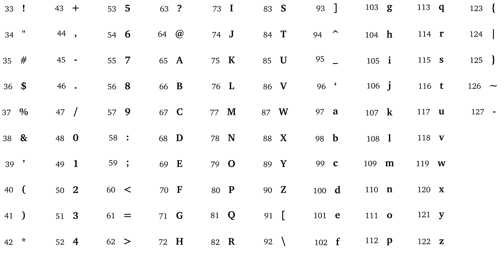
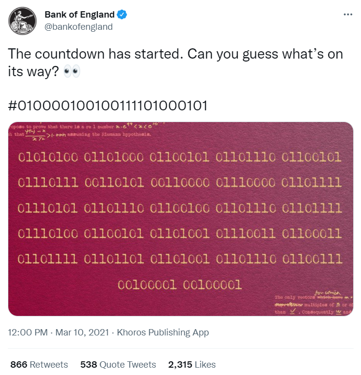

---
tags:
  - snt/codages
hide :
  - feedback
---
# Codage de caractères 


!!! abstract "Objectifs" 

	Codage des caractères et applications.
 

!!! info "Consignes"

	- Continuez à compléter [```Doctools```](https://link.dgpad.net/r2FF){ .md-button .md-button--primary  } , se connecter à l'aide des codes perso distribués.
	- Utiliser le code ```r2FF``` pour accéder au document à compléter en ligne.  


## Le codage des caractères en ASCII

Un caractère est stocké par l'ordinateur sous la forme d'un entier. Pour l'utilisation commerciale de centres de données, IBM a popularisé le codage ASCII (American Standard Code for Information Interchange) . C'est la norme de codage de caractères la plus influente à ce jour. 

!!! coeur "ASCII"
	ASCII définit ```128``` codes sur ```7``` bits, comprenant ```95``` caractères imprimables : les chiffres de ```0``` à ```9```, les lettres minuscules a à z (de 97 à 122) et majuscules A à Z (de 65 à 90), et des symboles mathématiques et de ponctuation. 
  
	
	
	Un 8e bit fut rajouté pour étendre le nombre possible de caractères à 256 et incorporer des caractères accentués. Les caractères associés aux valeurs ```128``` à ```255``` diffèrent selon les variantes linguistiques du codage ASCII. Pour l'Europe occidentale il s'agit de [la page de code 850](https://fr.wikipedia.org/wiki/Page_de_code_850){ .md-button .md-button--primary  } 
	 


!!! example "Exemple"
	Dans la norme ASCII un caractère correspond à un octet (8bit). On peut le représenter par une valeur entre 0 et 255, ou en écriture binaire à 8chiffres, ou en écriture hexadécimale à 2 chiffres.

	Le prénom ```Lyna``` correspond en ASCII aux valeurs ```76.121.110.97``` soit ```4C.79.6E.62``` en hexadécimal et ```01001100.01111001.01101110.01100001```en binaire. 

???+ question "Exercice 11 : Un mystérieux tweet " 
 

	Le 10 mars 2021, le compte twitter de la Banque d'Angleterre a posté le tweet ci-dessous :
	 
	
	 
	1. Déchiffrez le message écrit sur l'image.
	2. Déchiffrez le hashtag du message.
 


## Codages de caractères d'aujourd'hui

La diversité des implémentations de la norme ASCII rendait délicat l'utilisation simultanée de plusieurs langues dans un même document ou page web : une thèse en hébreux sur la Grèce antique par exemple, ou un site web en arabe avec des mots de japonais. Un codage de caractères en **Unicode** avec **2 octets par caractère** n'a pas été adopté car les anglophones sont longtemps restés réticents à doubler la taille de l'espace mémoire nécessaire ou pour stocker un même texte.

L'arrivée des smartphones ammène la nécessité de pouvoir proposer un même système/logiciel/application en différentes langues, ou d'écrire un courriel en chinois sur un téléphone acheté en France. Les informaticiens ont été contraints d'adopter une norme commune :  ce sera l'**UTF-8** (*Universal Character Set Transformation Format1 - 8 bits*). En plus de caractères cyrilliques, kanjis, hanzi, hangul,etc, l'UTF-8 permet de gérer même les emojis 🐓🥚🍳 ! 

Pour plus de détails sur la difficile adoption d'une norme de codage pour les caractères vous pouvez consulter ce [billet](https://kunststube.net/encoding/){ .md-button .md-button--primary  } 

!!! info  "Point Python"

	L'instruction ```chr()``` prend en entrée un code entier  et renvoie le caractère associé à un code.

	L'instruction ```ord()``` prend pour entrée un caractère et renvoie son Unicode.

	Taper ```chr(65)```  et ```ord("A")``` dans la console python.

	{{ terminal(TERM_H=4) }} 
 
 
???+ question "Exercice 12"  

	Quel est l'unicode de l'emoji 😎 ? 
	 
	{{ terminal(TERM_H=4) }} 
 
 