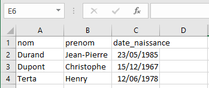

---
tags:
  - snt/données structurées
hide :
  - feedback
---
# Structurer des données
  
!!! Abstract "Objectifs" 
	- Utiliser un site de données ouvertes, pour sélectionner et récupérer des données
	- Présentation des données au format CSV   
	- Traitement de données structurées 
 
 
!!! info "Consignes"
	rédiger les réponses dans votre document [doctools](https://link.dgpad.net/rFjm), codes wims. 
 


## Exercice 1 L'ouverture des données publiques 

Dans une tradition de transparence et de partage des informations detenues par la puissance publique, la France est membre de la **Partenariat pour un gouvernement ouvert (PGO)**. 
 
1. Rappeler l'article 15 de la Déclaration des droits de l'homme et du citoyen de 1789. 
1. À l'aide de la page [:fontawesome-brands-wikipedia-w:ikipedia](https://fr.wikipedia.org/wiki/Partenariat_pour_un_gouvernement_ouvert){ .md-button .md-button--primary  } résumer les deux premiers objectifs du Partenariat PGO.
1. Lire le paragraphe &laquo; découvrir l'open data&raquo; sur [ data.gouv.fr](https://doc.data.gouv.fr/#d%C3%A9couvrir-lopen-data){ .md-button .md-button--primary  } et résumer en quelques lignes l'intêret de rendre accessible au public ces différents jeux de données.

## Exercice 2  Explorer des sites de données ouvertes

 [data.gouv.fr](https://www.data.gouv.fr){ .md-button .md-button--primary  } est une plateforme de diffusion de données publiques de l'État français. On y recense un grand nombre de données publiques librement réutilisables distribuées en des formats ```.csv``` ou ```.json```. En explorant  le site [data.gouv.fr](https://www.data.gouv.fr){ .md-button .md-button--primary  }  et ses différents jeux de données répondre aux questions suivantes :
  
1.   Rechercher le jeu de données &laquo; *pollution aérienne aux abords des écoles et crèches d’Île-de-France* &raquo;. Dans quel format sont enregistrées les données ?
1. Rechercher le jeu de données &laquo; *Chiffres départementaux mensuels relatifs aux crimes et délits enregistrés par les services de police et de gendarmerie* &raquo;.  Quelle est la fréquence de mise à jour de ce jeu de données ?
1. Rechercher le jeu de données &laquo;  *Données hospitalières relatives à l'épidémie de COVID-19* &raquo;. Identifier l'article de presse qui réutilise ce jeu de données. 
1. Rechercher le jeu de données &laquo;  *Temps de parole des hommes et des femmes à la télévision et à la radio* &raquo;. À l'aide d'une des réutilisations de ce jeu de données, retrouver la repartition moyenne du temps de parole à 18h sur BFM TV en 2019.  
1. Explorer le site [statistiques-locales.insee.fr](http://statistiques-locales.insee.fr/){ .md-button .md-button--primary  }.   Rechercher l'indicateur &laquo; Part des personnes âgées de 75 ans ou + &raquo;. Quelle est sa valeur pour la commune du Péage-de-Roussillon. 

 
!!! coeur  "À savoir : le format de données CSV" 
	Une **table** est un tableau particulier dans lequel la première ligne sert à décrire la forme des lignes suivantes.  
	
	Le format **Comma-separated values**, connu sous le sigle CSV peut stocker un tableau de données.  
	
	Les données tabulaire sont représentées sous forme de valeurs séparées par des virgules. Parfois cela peut-être un &laquo; ; &raquo; ou un espace de tabulation. 
	
	L'intérêt de ce format est qu'il est **ouvert**, lisible par bon nombre de logiciels !  

## Vocabulaire  

Les données du tableau peuvent être organisées  dans le fichier csv :

<div class="grid" markdown>

|```nom``` | ```prenom``` | ```date_naissance``` |
| :---: | :---: | :---: | 
|Durand |JeanPierre| 23/05/1985|
|Dupont |Christophe |15/12/1967|
|Terta |Henry |12/06/1978|  

 
```bash title="fichier.csv"
nom,prenom,date_naissance  
Durand,JeanPierre,23/05/1985  
Dupont,Christophe,15/12/1967  
Terta,Henry,12/06/1978  
``` 

</div>

- chaque  lignes concerne une personne différente. On parle d'**objets** décrits par la table.  
- ```"nom"```, ```"prenom"``` et ```"date_naissance"``` sont les **descripteurs** de ces objets.   
- ```"Durand"```, ```"Dupont"``` et ```"Terta"``` sont les **valeurs du descripteur** ```"nom"```.
 
!!! warning "Attention"
	Dans votre chapitre de Statistiques en mathématiques, vous utiliserez **individus/caractère** au lieu d'**objets/descripteur**.

 
## Exercice 3 Faire attention au séparateur utilisé

1. Télécharger les fichiers   [```fichier1.csv```](fichier1.csv)  et [```fichier2.csv```](fichier2.csv)  
1. Ouvrir le ```fichier1.csv``` avec dans notepad (bloc note, ou wordpad...) Quel est le séparateur utilisé dans chaque fichier ?
1. Ouvrir ```fichier1.csv``` et ```fichier2.csv``` avec Excel. Que remarquez vous ?
1. Pour importer proprement des jeux de données en ```.csv``` dans Excel, vous allez :
	- ouvrir un document vide
	- dans l'onblet Data/Données, choisir &laquo;à partir d'un fichier text/csv &raquo; 
	- choisir ```fichier1.csv```
	- choisir dans la fenètre affichée le bon délimiteur
	Vous devriez observer que les données sont bien "rangées" dans un tableau avec des lignes et des colonnes (voilà pourquoi on parle de données tabulaires).  
   
1. Pour quelle raison les données sont parfois séparées par un point-virgule (;) dans un fichier csv ?
 

## Exercice 4 Lire un fichier csv à l'aide de Python

 

1. Se rendre sur l'interface [basthon](https://basthon.fr/)  et choisir le mode   [Notebook](https://notebook.basthon.fr/).
	- pour exécuter dans notebook, il faut taper simultanément sur les touches Shift+Enter
	- pour effacer une entrée dans notebook, taper simultanément sur Esc+D, et répéter une seconde fois. 
1. Téléversez les  fichiers  [```fichier1.csv```](fichier1.csv)  et [```fichier2.csv```](fichier2.csv) précédents dans votre interface Python à l'aide du bouton <i class="far fa-folder-open"></i> 
1. Saisir et exécuter le script suivant  (copier-coller)
```python linenums="1"
import pandas as pa		# invoque module pandas sous le pseudonyme pa
donnees = pa.read_csv("fichier2.csv", sep=';')	
				# donnees est un tableau avec le contenu de fichier2.csv
				# sep=';' indique que le séparateur est un point-virgule
``` 
1. Exécuter les instructions. Décrivez (sans tout réécrire) ce qu'elles affichent et à quoi elles servent.
```python 
donnees.shape   
donnees.info()  
donnees.head(2)
```  
1. Une fois le notebook terminé, copier le lien permanent généré à l'aide du bouton <i class="fas fa-share-alt-square"></i> et coller le dans votre document doctools.


 
!!! coeur  "à retenir"
	Il existe une multitude de formats pour structurer les données.

	Le html pour structurer le contenu de pages webs. Le format xls est utilisé par les tableurs.  
	
	Le standard csv a l'avantage de rester simple, de taille réduite, lisible avec quasiment tous les logiciels disponibles. 

	
	