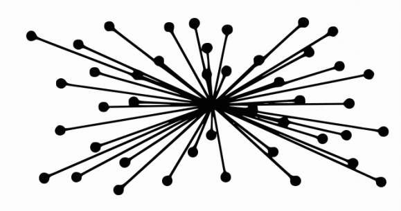

---
tags:
  - snt/internet
hide :
  - feedback
---
# Internet : découverte 
   
	
!!! info "Introduction"
	===  "Vidéo 1 : [What's the Internet](https://www.youtube.com/watch?v=Dxcc6ycZ73M) par [Code.org](https://code.org/)"
		<iframe  width="100%" height="416px" src="https://www.youtube.com/embed/Dxcc6ycZ73M?rel=0&showinfo=0" frameborder="0" allow="accelerometer; autoplay; clipboard-write; encrypted-media; gyroscope; picture-in-picture" allowfullscreen></iframe>

	===  "Vidéo 2 : [Naissance d'Internet](https://vimeo.com/122104260) par [L'Université de Lille](https://vimeo.com/universitelille)[^1]"
	
		<iframe src="https://player.vimeo.com/video/122104260?color=b50067&title=0&byline=0&portrait=0" width="100%"  height="416px" frameborder="0" allow="autoplay; fullscreen; picture-in-picture" allowfullscreen></iframe>

		??? notes "cours" 
	  
			Dans les années soixante, il existait aux États-Unis de gros centres de calcul abritant de très gros ordinateurs. Ceux-ci étaient reliés entre eux par des câbles qui leur permettaient de transporter l'information numérique : des réseaux informatiques (network en anglais souvent abrégé en net).

			En période de guerre froide, les États-Unis craignaient de voir leurs centres bombardés ou une ligne qui reliait 2 centres coupée. Il fallait pouvoir communiquer entre des centres stratégiques et pouvoir bénéficier à distance des résultats des supercalculateurs même en cas d'attaque nucléaire. Ils ont demandé aux chercheurs de proposer un système qui serait tolérant aux pannes ou aux bombes !

			L'idée a été de multiplier les centres et d'interconnecter les réseaux de chaque centre. Pour protéger l'ensemble, la proposition a été de multiplier les chemins entre centres. Ainsi si un centre explosait ou qu'une ligne était coupée, les autres centres pourraient encore communiquer entre eux en passant par d'autres chemins : ce fut la naissance d'ARPANET (1971).

			Ce système a tout de suite rencontré un grand succès. Il a ensuite évolué vers INTERNET, nom qu'on lui a donné au début des années 80 pour signifier qu'il s'agit d'une interconnexion de réseaux.

 
!!! coeur "Les principes fondateurs"
	Internet désigne une **Infrastructure** regroupant des machines réparties dans le monde entier, interconnectées de manière à ce que chacune puisse communiquer avec toutes les autres. Cette organisation complexe nécessite des règles pour fonctionner correctement. 
	
	Elle repose sur **3 principes fondateurs** :

	1. interconnexion
	2. principe de bout-en-bout : le savoir en périphérie du réseau
	3. les protocoles internet et la gouvernance de l'internet
	  

## Principe 1 : Interconnexion des réseaux

C’est la possibilité de faire dialoguer plusieurs sous réseaux initialement isolés dans l'objectif d'assurer une transmission fiable des données. Le mot internet vient de  la contraction des mots _interconnection_ et _networks_ (interconnexion de réseaux).

Elle se base sur des accords négociés indépendamment avec opérateurs de communications (privés ou public) concernant :

- **Transit IP**  vendue par les fournisseurs d'accès Internet (FAI) à d'autres réseaux clients, afin  d'accéder à la totalité d'Internet.
- **Peering** échange de trafic Internet avec des peers (pairs) : d'autres opérateurs ou des fournisseurs de contenu

!!! example "Évolution de l'interconnexion de 1997 à 2021 [The Internet: 1997 - 2021](https://www.youtube.com/watch?v=DdaElt6oP6w) "
	Version longue disponible [:fontawesome-brands-youtube:](https://www.youtube.com/watch?v=-L1Zs_1VPXA) par [Opte Project](https://www.opte.org/the-internet).  
	
	<iframe  width="100%" height="416px" src="https://www.youtube.com/embed/DdaElt6oP6w?rel=0&showinfo=0" frameborder="0" allow="accelerometer; autoplay; clipboard-write; encrypted-media; gyroscope; picture-in-picture" allowfullscreen></iframe>
	
	- Blanc est la dorsale Internet (terme vague qui désigne les réseaux longue distance de plus haut débit)
	- Bleu = Amérique du Nord
	- Rouge = Asie Pacifique
	- Jaune = Afrique
	- Vert = Europe 
 
!!! example "[Carte du réseau internet](https://global-internet-map-2021.telegeography.com/) de 2021"
	Code couleurs pour les continents, avec les principaux réseaux reliant les mégalopoles mondiales.
 

## Principe 2 : Principe de bout-en-bout

| Internet |   Réseau central d'une université (dès les années 60), le Minitel en France (dès les années 80)| 
| :---: | :---: | 
| réseaux distribués ou décentralisés | réseaux centrés, typiquement en étoile |  
|   |  |  
| Intelligence en périphérie  | Intelligence au centre |  
| Les ordinateurs au sein du réseau n'exécutent que les fonctions nécessaires au fonctionnement du réseau | Calculateurs au centre, bases de données, annuaires, le savoir au centre|  
| tous les ordinateurs peuvent être clients et serveurs à la fois | terminaux de consultation passifs |

 

## Principe 3 :  Protocoles et Gouvernance

La gouvernance d'Internet est l’élaboration et l’application, par les **États**, le **secteur privé**, la **société civile** et les **organisations internationales**, de _principes_, _normes_, _règles_, _procédures_ de prise de décision et _programmes_ qui visent à façonner l’évolution et l’usage de l'Internet.


<figure markdown="span">
  
  <figcaption>Gouvernance d'internet</figcaption>
</figure>


Un rôle crucial est joué par les associations pour défendre la vision d'un internet pour tous et préserver les principes fondateurs d'interconnexion et de bout-en-bout. 

!!! example "L'IETF : [Internet Engineering Task Force](https://www.ietf.org/)"

	{ width=100px , align=right } 
	Élabore les standarts des communications TCP/IP. Sa devise est : 
	> « We reject Kings, Presidents and voting.
	We believe in rough consensus and running code.
	(Dave Clark) »

!!! example "W3C : [Le World Wide Web Consortium](https://www.w3.org/)"

	{ width=100px, align=right }
	Élabore les standarts des technologies du World Wide Web (HTML, CSS, PNG, SVG...).   
	Sa devise est :
	> « Un seul web partout et pour tous »


!!! info "Consignes"  

	- À partir de la page [```Doctools```](https://link.dgpad.net/LMd3){ .md-button--primary  }, se connecter à l'aide des codes perso distribués.
	- Utiliser le code ```LMd3``` pour accéder au document à compléter en ligne. 
	- Vous pouvez travailler en binôme, renseigner votre partenaire dans l'espace réservé. 
	- Les groupes de 3 ou plus sont **interdits**.
	- Le travail est sauvegardé au fur et à mesure. Vous pouvez poursuivre en cas de coupure.
	- Vous pouvez travailler sur un document hors-ligne, et renseigner les réponses une fois terminé.   

???+ question "Exercice 1 Services offerts par Internet"

	Il ne faut pas confondre Internet, avec les services qui utilisent le réseau Internet. Complétez le tableau ci-dessous en nommant le service et détaillant les rôles de chacun des protocoles.

	| Nom du protocole| Service| Rôle  |  
	|:----:|:----:|:--|
	|HTTP|Le WEB| visualisation des pages web et les news, groupes et forums de discussion | 
	| FTP|  | | 
	| SMTP|  | |
	| POP| | | 
	| IMAP|  | |
	|SSH et TELNET   | | 

???+ question "Exercice 2 Repères historiques"
 
	Complétez les dates dans la colonne de gauche. Vous pouvez vous aider de la page [Wikipédia _l'histoire d'internet_](http://fr.wikipedia.org/wiki/Histoire_d'Internet){ .md-button--primary  },  
	  
	| Date | Élément de culture numérique et technologique |  
	|:----:|:--|
	|	| Premier cable transatlantique | 
	|	| Premier modem permettant de transmettre des données binaires sur une simple ligne téléphonique |
	|	| Création aux États-Unis du réseau Arpanet (23 ordinateurs), l'ancêtre d'Internet. Il établit  une connexion entre les ordinateurs de 4 universités et vise à partager les ressources informatiques et communiquer entre les scientifiques de ces universités. C'est le premier réseau à **communication par paquets** : envoi  d'information en petites unités, par différents itinéraires puis rassemblées dans l'ordre à la destination. Cela rend possible de changer d'itinéraire et permet au réseau de continuer de fonctionner même si certaines parties viennent à être détruites|
	|	| Naissance de l'International Network Working Group, organisme chargé de la gestion d’Internet. |
	|	| Naissance du réseau français Cyclades sous la direction de Louis Pouzin |
	|	| Définition des **protocoles TCP/IP** qui    permettent d'uniformiser les modes de connexions aux différents réseaux et ouvre la voie à la création d'un _réseau des réseaux_, et rend possible d'élargir la taille du réseau Arpanet |
	|	|  Le réseau ARPANET adopte les protocoles TCP/IP et prend le nom  Internet.  Il devient indépendant du département de la Défense américain. | 
	|	| Internet s'ouvre au grand public. Arpanet disparait. |
	|	|   Annonce publique du World Wide Web (Tim Berners-Lee). |
	|	| Navigateur Web NCSA Mosaic : premier navigateur à afficher les images dans les pages web elles-mêmes, puis à supporter les formulaires interactifs dans les pages. |
	|	| Dépassement des 4 milliards d’internautes dans le monde |
	|	| Arrivée du très Haut débit en France |
	|	| Couverture intégrale de la  France en Très haut débit | 

???+ question "Exercice 3 Évolution du trafic internet et défis"
 
	En vous aidant des liens  de  [:fontawesome-brands-youtube:](https://youtu.be/5kXKPCqRbRI){ .md-button--primary  }, des [statistiques 2018](http://www.blogdumoderateur.com/chiffres-internet/){  .md-button--primary  } et du
	 [Rapport](https://www.cisco.com/c/en/us/solutions/collateral/executive-perspectives/annual-internet-report/white-paper-c11-741490.html){ .md-button--primary  } 
	répondre aux questions suivantes : 
	
	1. Analysez la carte [Submarine Cable Map](https://www.submarinecablemap.com/) 
		- Préciser les principaux flux de données sur Internet entre les régions du monde
		- Identifier le câble sous-marin dont l'une des extrémités est la plus proche du Péage-de-Roussillon et retrouver sa longueur et quelques extrémités. 
	1. Combien y avait-il dans le monde d'ordinateurs connectés en 1984 ? En 1987 ? En 1989 ? Aujourd'hui ?
	1. En quelle année a-t-on passé la barre du million d'utilisateurs ?
	1. Quelle proportion de la population mondiale n'a pas accès à internet ?
	1. À l'inverse, quelle proportion a accès à internet en France ? Est-ce supérieur ou inférieur à la moyenne européenne ? Est-ce supérieur ou inférieur à la moyenne aux USA ?
	1. En 1 minute, dans le monde, combien de recherche Google ? Combien de mails sont envoyés ? Combien de contenus sont partagés sur Facebook ?
	1. Quel est la part de Netflix dans le Traffic internet en France ?
  
!!! info "Les types de liaisons physiques de transmission par [L'Université de Lille](https://vimeo.com/universitelille)"
	 
	=== "[Supports de transmission de l’information](https://vimeo.com/122104443)"
	
		<iframe src="https://player.vimeo.com/video/122104443?color=b50067&title=0&byline=0&portrait=0" width="100%" height="416px" frameborder="0" allow="autoplay; fullscreen; picture-in-picture" allowfullscreen></iframe>
	  

	=== "[Connexions nomades et vitesse de transmission](https://vimeo.com/122104499)"
			
		<iframe src="https://player.vimeo.com/video/122104499?color=b50067&title=0&byline=0&portrait=0" width="100%" height="416px" frameborder="0" allow="autoplay; fullscreen; picture-in-picture" allowfullscreen></iframe>
			
	??? notes "cours (à dérouler)" 
	  
		Internet et plus généralement les réseaux informatiques peuvent utiliser plusieurs types de supports pour transporter l'information numérique. On distinguera les supports physiques, les câbles qui peuvent être électriques ou optiques et les ondes électromagnétiques comme le Wifi, le Bluetooth ou les réseaux de téléphonie mobiles. Nous allons voir qu'une connaissance minimale de ces technologies va nous permettre de mieux comprendre les enjeux qu'ils cachent.

		#### Le débit
		Tout d'abord nous devons introduire la notion de débit. Si on prend l'image d'un robinet d'eau, on voit bien qu'un robinet avec un gros tuyau me permettra de remplir mon seau beaucoup plus vite qu'avec un petit robinet qui ne laisse passer qu'un léger filet d'eau. Le débit dans ce cas est une quantité d'eau par seconde. La problématique est la même pour le réseau internet. Nous avons vu précédemment que les informations numériques étaient ramenées à des suites de bits (des 0 et des1). Le débit sera donc pour les réseaux en nombre de bits par seconde. Comme cette information circule très vite on parlera en fait de milliers de bits par seconde (kb/s), de millions de bits par seconde (Mb/s) voire de milliards de bits par seconde (Gb/s). À titre indicatif, voici quelques ordres de grandeur, un document texte d'une dizaine de pages se code avec quelques kbits, un fichier mp3 de musique de quelques minutes se compte en Mbits alors qu'un film d'une heure correspond à plusieurs Gbits.

		#### Les supports et les normes relatives à leur utilisation
		Nous allons dans la suite présenter les différents supports utilisés dans les réseaux. Ils ont connu de fortes évolutions depuis les débuts d'internet. Parfois cette évolution est purement matérielle comme l'apparition de la fibre optique, d'autres fois l'évolution consiste en une meilleure utilisation du support. L'utilisation du support est décrite dans un ensemble de normes comme par exemple la 3G ou la 4G qui tous deux utilisent le support des ondes. Aussi la présentation suivante s'appuie à la fois sur les deux notions de norme et de support.

		#### Les câbles  
		S'agissant des câbles on distingue les câbles électriques et les fibres optiques qui transportent la lumière. Ces dernières sont évidemment beaucoup plus rapides et sont utilisées prioritairement quand c'est possible. C'est le cas par exemple de la plupart des câbles sous-marins qui traversent les océans pour relier les continents, certains ont des débits supérieurs à 100Gb/s. Des câbles électriques spécifiques pour les réseaux informatiques peuvent également être très rapides mais sur des courtes distances. C'est en général la solution retenue pour connecter les ordinateurs d'un réseau local dans les entreprises. C'est aussi le cas pour les ordinateurs à votre disposition dans les salles informatiques de l'université.

		En revanche, ce n'est pas le cas de la plupart du réseau français qui relie la majorité des foyers du pays. Les lignes qu'on appelle ADSL, sont en fait les câbles de l'ancien réseau téléphonique qui a été construit à l'origine pour transporter la voix du téléphone et non des informations numériques à très grande vitesse. Cela explique que les connexions dont nous disposons à domicile sont de qualité moyenne et ne permettent pas le très haut débit, sauf à passer par une fibre optique, c'est ce que proposent désormais beaucoup de fournisseurs d'accès dans certains quartiers.

		Évidemment, le câblage de toutes les zones habitées avec de la fibre optique représente un enjeu social et économique considérable. Alors que les lignes de téléphone sont présentes sur l'ensemble du territoire, seules les grandes agglomérations sont couvertes par l'équipement en fibres optiques. Cela représente un grand facteur d'inégalité...

		#### Les ondes  
		Depuis le XIXème siècle, les hommes ont réussi à s'échanger des informations via les ondes électromagnétiques. La radio puis la télévision ont copieusement utilisé ce principe qui utilise un système d'antennes émettrices et réceptrices. Nous savons transporter de la même façon des informations numériques. À chaque réseau son antenne, certains appareils sont équipés d'une antenne Wifi, d'une antenne Bluetooth et pour les téléphones d'une antenne de réseau de données mobiles. Ces différentes technologies sont essentiellement utilisées pour nos connexions nomades, c'est-à-dire avec des appareils mobiles tels que des ordinateurs portables, des tablettes ou des smartphones. Fondamentalement, elles permettent toutes la même chose, c'est à dire un accès complet à internet.

		#### Les connexions nomades  
		On se retrouve régulièrement à devoir choisir parmi plusieurs moyens pour se connecter à internet avec nos appareils nomades. Les arguments qui entrent dans ce choix sont très variés. On pense bien entendu au coût. Par exemple, l'utilisation du wifi de l'université est gratuite. Les accès internet par le biais d'une box sont généralement inclus dans un forfait illimité, en revanche le coût de l'utilisation d'internet à l'aide de connexions 2G/3G/4G peut rapidement exploser.

		Un autre élément déterminant est la disponibilité de la connexion. En effet, selon les endroits où l'on se trouve, le réseau mobile peut être indisponible ou de très faible qualité, inversement il n'y a pas toujours un accès Wifi à notre portée. Notons que si l'on se déplace de plus de quelques mètres, il devient quasi-impossible de rester connecté à un réseau wifi qui a une portée assez faible. Les réseaux de téléphonie mobiles autorisent par contre une connexion permanente sur des longues distances à pied ou en voiture par exemple.

		Depuis les années 90, le réseau de téléphonie mobile permet le transfert de données numériques.

		Mais les normes et les techniques évoluent et sont de plus en plus rapides. Les premières générations proposaient des débits très faibles qui ne permettaient pas par exemple le transfert d'images ou de musique dans des temps raisonnables. Nous en sommes à la quatrième génération de la technologie, la 4G offre maintenant des débits qui dépassent parfois ceux des connexions wifi.

		#### La rapidité du réseau  
		Toutefois, la qualité du lien qui relie votre appareil électronique au réseau n'est pas le seul responsable du débit. Réfléchissons à ce qui fait que ma liaison est lente ou rapide. Tout d'abord il faut se rappeler que les débits indiqués par les constructeurs ou les opérateurs sont toujours théoriques et correspondent au maximum possible dans les meilleures conditions. En pratique, ces conditions sont rarement réunies et les débits peuvent être considérablement ralentis en fonction de plusieurs facteurs :

		le premier facteur que l'on peut citer est l'éloignement, celui-ci joue aussi bien pour les connexions par onde que pour les connexions par câble. Par exemple, les accès ADSL sont très différents selon qu'on a la chance d'habiter près d'un nœud de raccordement aux abonnés (qui contient les machines des fournisseurs d'accès) ou si on en est plus éloigné, les débits peuvent alors être 10 ou 20 fois plus rapides, … pour le même prix d'abonnement.
		De même, si on s'éloigne au fond du jardin avec son portable, la connexion wifi à notre box va considérablement perdre en qualité, jusqu'à ne plus être accessible.
		un autre facteur important est le nombre d'utilisateurs du réseau, quelle que soit la technologie utilisée, on peut voir les autoroutes de l'information comme de vraies autoroutes, lorsqu'il y a beaucoup de voitures le trafic est ralenti, de la même façon, si une connexion wifi par exemple est partagée par plusieurs utilisateurs, le débit sera réparti entre eux et aucun d'entre eux n'aura accès au débit maximum
		L’encombrement du réseau est encore un autre facteur, les routeurs peuvent être vus comme les péages des autoroutes, ce sont des goulots d'étranglement qui bouchonnent lorsque beaucoup de demandes arrivent en même temps
		enfin, il arrive que l'actualité fasse que certains sites soient sollicités au même moment par des milliers ou des millions d'utilisateurs, le site ne pouvant répondre à tout le monde en même temps, le temps de réponse pour chacun se trouve considérablement ralentie.
		Ainsi, il est très fréquent de constater que la vitesse de transmission des données varie dans le temps ; varie selon les endroits ou les moyens avec lesquels on se connecte à internet ou encore varie selon les sites que l'on visite ou les services que l'on demande. Comme nous venons de le voir, la vitesse d'une connexion dépend de nombreux facteurs. Difficile donc de savoir d'où vient un ralentissement quand il intervient. Mais parfois, le simple changement du mode de connexion utilisé peut faire des miracles. Soyez agiles !!! 

			
???+ question "Exercice 4"

	En vous aidant des vidéos ci-dessus ou  à partir de vos propres connaissances, remplir le tableau des différents types de liaisons physique. Préciser si possible le débit ainsi que leur portée. 
	
	
	 
	| Type de Liaisons filaires | exemples | portée  | débit |
	| :---: | :---:   | :---: | :---: |  
	| câbles téléphoniques | | | |
	| câbles spécialisés| | | |
	| fibre optique | | | |
	| | | | |


	| Type de Liaisons hertziennes | exemples  | portée  | débit |
	| :---: | :---:   | :---: | :---: |  
	| Bluetooth | | | |
	| Wifi | | | |
	| Téléphonie mobile | | | |
	| Liaisons satellites | | | |
	| | | | |


???+ question "Exercice 5 Le traffic Internet"

	_15 min_
 
	À l'aide d'une recherche Web, complétez les phrases suivantes.

	1. Chaque **minute** ```_________``` photos sont partagées sur **Facebook**
	1. Chaque **minute** ```_________``` messages sont partagées sur **Facebook**
	1. Chaque **minute** ```_________``` stories sont postées sur **Instagram**
	1. Chaque **minute** ```_________``` annonces publicitaires et profils d'entreprises sont visionnés sur **Instagram**
	1. Chaque **minute**, **TikTok** est installé ```_________``` fois.
	1. Chaque **minute** ```_________``` messages sont échangés sur **WhatsApp**
	1. Chaque **minute** les utilisateurs de **Reddit** réagissent à ```_________``` billets
	1. Chaque **minute** ```_________``` heures de vidéos sont téléversées sur **YouTube**


???+ question "Exercice 6 : Quelques ordres de grandeurs"

	Le débit est une des mesures caractérisant la qualité d'une connexion. Il mesure la quantité d'information que l'on peut transmettre à chaque seconde en ```bit/s``` (ou ```kbit/s```, ```Mbit/s``` etc).  
	Sachant que l'on peut stocker 50 gigaoctet (Go) sur un DVD Blu-ray double couche, calculer le temps de transmission d'un DVD Blu-ray double couche complet dans les cas suivants :   
	
	- l'ADSL à 10Mbit/s  
	- La fibre à 1Gbit/s  
	- Le wifi à 50Mbit/s  
	- La 3G à 384 Kbit/s  
	- La 4G à 150Mbit/s


???+ question "Exercice 7 : Représenter le réseau local de votre maison"

	Vous indiquerez le type de connexion (Wifi, ethernet...) utilisés depuis le boitier Box internet par les différents objets connectés (ordinateurs, smartphone, télévision, caméra de sécurité, Nabaztag, autocuiseur ou réfrigérateur connecté, amazon echo ou google chromecast, lampe connectée).
 
  
## Références
 
[^1]: extrait du module de [**culture numérique**](https://culturenumerique.univ-lille.fr/index.html)  de l'Université de Lille.
