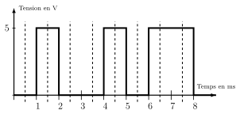

---
tags:
  - snt/internet
hide :
  - feedback
---
# Internet  : comment ça marche ? 
 

!!! info Cours 

	La suite des **protocoles Internet** est l’ensemble des protocoles utilisés pour le transfert des données sur Internet.
	C’est un ensemble de règles précisant le format des informations échangées, la manière de les échanger, d’établir la communication et de la terminer.

	Les protocoles sont répartis par couches. 

 

## Les protocoles
   
### Problématique 1 : La couche physique[^1] 

Supposons que nous souhaitons établir une transmission d'informations numériques à l'aide d'un câble en cuivre entre deux interlocuteurs. 
L'approche la plus simple serait l'émission et réception d'un bit ou d'un train de bits en appliquant une tension à un bout : 

- **symboles** 2 états possibles : 0V et 5V, qu'on peut les associer à des nombres : 0 au symbole 5V, 1 au symbole 5V (par exemple). 
- **débit** nombre de bits envoyés par seconde. 
- **envoyer des caractères** en utilisant par exemple la correspondance [ASCII](https://fr.wikipedia.org/wiki/American_Standard_Code_for_Information_Interchange#Table_des_128_caract%C3%A8res_ASCII). 


Si pour un même signal, le récepteur lit à des fréquences légèrement différentes au niveau des verticales en pointillés :

<div class="grid" markdown>

On lit  ```01001011```, le code ASCII de la lettre ```K```.


On lit  ```01000101```, le code ascii de la lettre ```E```.
</div>
 

!!! coeur "La couche physique" 
	compte les  techniques de codage du signal (électronique, radio, laser) pour la transmission  effective  entre les interlocuteurs (réseaux filaires cuivrés, optiques, radioélectriques ).


### Problématique 2 : La couche liaison

Imaginons que nous avons reçu le train de bits suivant ```110100101101000001110```. Sans plus d'indications on peut regrouper les bits de différentes manières et changer le contenu :

- **possibilité 1** ```11:01001011:01001001:110``` donnera les lettres ```KI```
- **possibilité 2** ```1101:00101101:0100111:0``` donnera les lettres ```-'```

!!! coeur "La couche liaison de données"  
	se charge des communications entre deux machines  connectées entre elles directement ou via un commutateur (switch des réseaux locaux).

	On y compte les protocoles PPP (via fibre optique) et protocoles MAC (Ethernet, Wi-Fi), protocoles Bluetooth.

	Les données que l'on veut transmettre sur ses réseaux informatiques sont **encapsulées** à l'intérieur d'une **trame** : l'ensemble de données est **encadré** par des _bits de début_ et des _bits de fin_ appelés drapeau et fanion.
  
### Problématique 3 : La couche réseau 

!!! coeur "La couche réseau" 

	Les données sont **encapsulées** à l'intérieur de **paquets** qui circulent de proche en proche entre machines (en utilisant les protocoles de la couche liaison qui encapsulent les **paquets** dans des **trames**).

	Le protocole IP se charge du **routage** et de l'**adressage des paquets**. 

!!! info "[Comment ca marche](https://vimeo.com/122104315) par [L'Université de Lille](https://vimeo.com/universitelille)[^2]"

	<iframe src="https://player.vimeo.com/video/122104315?color=b50067&title=0&byline=0&portrait=0" width="100%" height="416px" frameborder="0" allow="autoplay; fullscreen; picture-in-picture" allowfullscreen></iframe>

	??? notes "cours (à dérouler)"  

		Regardons un peu plus précisément comment fonctionne internet. Trois ingrédients importants interviennent dans le système.

		Le premier est l' adresse IP qui permet de fournir un nom et une adresse à chaque machine. Chaque ordinateur connecté à internet a un numéro unique (un peu comme un numéro de téléphone, mais bien plus long !). Ce numéro dépend de l'endroit où l'ordinateur se trouve dans internet et permet donc de trouver un chemin dans l'interconnexion de réseaux. On appelle ce numéro l'adresse IP . De façon très simplifiée, l'adresse IP comporte une partie identifiant un réseau dans cette interconnexion et une autre partie identifiant la machine au sein de ce réseau. Pour échanger des informations d'un ordinateur vers un autre, celui qui envoie l'information doit donc connaître l'adresse IP du destinataire, et pour obtenir une réponse, l'émetteur doit impérativement fournir dans chaque message envoyé sa propre adresse IP . Tous les messages échangés sur internet sont donc de la forme : n°IP destinataire / information / n°IP émetteur .

		Le deuxième ingrédient concerne le routage des messages sur le réseau. Si les ordinateurs émetteur et destinataire sont dans le même réseau, le principe est simple : l'ordinateur émetteur envoie son message sur ce réseau et chaque ordinateur du réseau le lit. Les destinataires peuvent alors s'intéresser aux messages qui leurs sont destinés. Si le destinataire n'est pas dans le même réseau, la transmission ne peut plus se faire directement à l'ordinateur du destinataire. L'émetteur envoie le message à une machine connectée à la fois à ce réseau et à un ou plusieurs autres réseaux. Cette machine est une passerelle/routeur qui réalise effectivement l'interconnexion. Le routeur renvoie alors le message vers les autres réseaux pour poursuivre son chemin. Et ce processus se répète jusqu'à ce que le message arrive à destination.

		Enfin le troisième ingrédient concerne le nommage des machines . En effet, ce sont des femmes et des hommes qui utilisent ces machines. Pour désigner un destinataire, personne ne manipule directement des adresses IP qui sont des numéros bien plus longs que les numéros de téléphone. Dans notre interface avec le monde d'internet nous connaissons plutôt des noms comme www.univ-lille.fr ou encore www.service-public.fr . Le lien entre adresses IP et noms se fait par le biais des serveurs de noms qui, à la manière d'une liste de contacts dans notre téléphone, stockent un ensemble de noms et d'adresses IP .

		Très concrètement, regardons par exemple ce qui se passe lorsque je veux consulter la page d'accueil de Lille 3. Tout d'abord, je clique sur un lien vers le site de l'université. Ce lien contient le nom de la machine capable de me fournir la page d'accueil : www.univ-lille.fr . Mon ordinateur va donc contacter un serveur de noms pour connaître l'adresse IP de cette machine. Une fois que cette adresse IP est connue, il peut communiquer avec www.univ-lille.fr et envoyer à cette machine un message qui demande le contenu de cette page d'accueil. Le message contient bien entendu l'adresse IP de mon ordinateur, ainsi la machine peut me répondre en renvoyant le contenu qui m'intéresse. Il ne reste plus alors à mon ordinateur qu'à afficher ce contenu.
 
 
### Problématique 4 : Les serveurs de noms, un maillon fragile

!!! coeur 
	La norme qui régit le fonctionnement des serveurs de noms propose une organisation pyramidale des machines. Les machines au sommet de cette pyramide sont les serveurs racine de **DNS** ( **Domain Name System** ).

	En français, on parle de **système de nom de domaine**.  
 

## Exercices 

!!! info "Consignes"  

	- À partir de la page [```Doctools```](https://link.dgpad.net/DhwJ){  .md-button--primary  }, se connecter à l'aide des codes perso distribués.
	- Utiliser le code ```DhwJ``` pour accéder au document à compléter en ligne. 
	- Vous pouvez travailler en binôme, renseigner votre partenaire dans l'espace réservé. 
	- Les groupes de 3 ou plus sont **interdits**.
	- Le travail est sauvegardé au fur et à mesure. Vous pouvez poursuivre en cas de coupure.
	- Vous pouvez travailler sur un document hors-ligne, et renseigner les réponses une fois terminé.  
	
	
???+ question "Exercice 1 Combien y-a-t-il d'adresses IP ?" 
  
	Les fondateurs d'internet n'envisageaient sûrement pas le succès phénoménal qu'il a rencontré. Aussi, le système de numérotation des adresses IP n'a pas été prévu suffisamment large pour répondre au nombre d'utilisateurs grandissant. Nous sommes depuis quelques années arrivés à un stade de pénurie d'adresses IP. La norme a donc dû évoluer. Aujourd'hui, deux normes cohabitent en attendant que tous les anciens systèmes s'adaptent à la nouvelle. Ces deux normes portent les noms de IPV4 et IPV6. 
	
	Faites des recherches sur les normes IPv4 et IPv6.  
	
	1. Déterminer le nombre de numéros IPv4 différents possibles. Savez vous donner un ordre de grandeur à l'aide d'une puissance de 10 ? 
	1. Combien pourrait-on avoir de numéros IPV4 différents par mètre carré de la surface de la terre ?


???+ question "Exercice 2" 

	À partir de la page [:fontawesome-brands-wikipedia-w:ikipedia](http://fr.wikipedia.org/wiki/Serveur_racine_du_DNS){.md-button--primary  }, faites les recherches nécessaires pour répondre aux questions suivantes :  
	1. Si ces machines s'arrêtaient, la traduction des adresses IP en nom et vice-versa s'arrêterait. Quel serait, à votre avis, l'impact de cet arrêt ?  
	1. Combien existe-t-il de serveurs racine de DNS ?  
	1. Qui possède ces machines : des états, des organisations, des sociétés privées ?  
	1. Où se trouvent-elles majoritairement ?  
	1. Que s'est-il passé en 2002 et 2007 ?  
 
???+ question "Exercice 3  Utiliser les serveurs de noms depuis un ordinateur" 

	Il existe des outils dans votre ordinateur pour interroger les serveurs de noms et faire donc la conversion entre adresses IP et noms de domaine. Ils sont intégrés par exemple dans le navigateur web et la plupart des outils qui utilisent internet.

	1. Sur votre ordinateur, ouvrir une console en appuyant simultanément sur les touches ++windows+r++ , puis rentrer ```cmd``` (pour command prompt) et cliquer sur Ok !  
		  
	1. Dans la console, nous allons faire un ```ping www.google.com```. Quel est l'adresse IP affichée ?   
	 
	1. Copier l'adresse IP que vous venez de trouver dans la barre d'adresse de votre navigateur. Que constatez-vous ?  
	1. Quelle est l'adresse IP du domaine [www.wikipedia.org](https://www.wikipedia.org) ?  
	1. On peut récupérer le nom de domaine de certaines machines à partir de l'adresse IP. Pour cela on utile la commande ```nslookup```   
		   
		À quel machine appartient l'adresse IP ```157.240.18.35``` ?

 
???+ question "Exercice 4 Utiliser les serveurs de noms depuis des services en ligne"

	1. Selon le site [monip.fr](http://www.monip.fr) quelle est votre adresse IP ? Où vous trouvez-vous selon ce site ? 
	1. Il est possible de faire les traductions Nom de domaine vers Adresse IP (et vice versa) sur des sites Web. Les coordonnées des responsables du domaines lorsqu'elles sont publiques.  
	À l'aide de la page Web [whatsmyip.org/whois-dns-lookup](https://www.whatsmyip.org/whois-dns-lookup/), vérifier les coordonnées des responsables du site ```www.csja.fr``` et l'hébergeur du site.
  

???+ question "Exercice 5 Panne générale"   

	Soit le réseau interconnecté de réseaux locaux suivant :  
	  
	Nous supposons que les communications dans chaque réseau local fonctionnent correctement, c'est-à-dire que chaque ordinateur connecté d'un réseau local peut communiquer avec n'importe quel ordinateur du même réseau local et les routeurs en liaison directe.

	L'ordinateur A doit échanger des données avec l'ordinateur B.

	1. Indiquer le groupe minimal de routeurs qui devraient tomber en panne pour empêcher la communication entre A et B ?
	1. Dans le cas des câbles, quel ensemble minimal de câbles devraient être coupés pour empêcher la communication entre A et B ?
	1. Lister tous les chemins possibles (sans boucle) qui permettent de relier A à B.


???+ question "Exercice 6 Suivre une commutation (transmission) de paquets"   

	La commande Windows ```tracert``` (pour mac et linux on utilise ```traceroute```) permet de suivre le chemin emprunté par un paquet IP pour arriver à sa destination.  
	
	1. Choisir un site qui vous est familier. Par la suite j'ai choisi ```www.csja.fr```   
	1. Ouvrir une console Windows  et  rentrer l'instruction ```tracert www.csja.fr```  
		  
		et noter le chemin suivi par une requête de la page Web du CSJA. 
		
		Vous utiliserez le site [https://whatismyipaddress.com/ip/](https://whatismyipaddress.com/ip/) pour situer géographiquement certaines des adresses IP.
	
## Bilan 
 
!!! coeur "La couche réseau : les protocoles IP  et DNS" 

	Afin de pouvoir s'identifier, tout ordinateur possède une adresse sur un réseau : **son adresse IP**
	
	- Les adresses IP(v4) sont de la forme : ``a.b.c.d", avec a, b, c et d des 	nombres compris entre 0 et 255.
	- l’adresse IP étant difficile à retenir on associe souvent un ordinateur à un nom appelé adresse symbolique (par exemple ```csja.fr```)
	- un **serveur DNS** (Domain Name Server) est un serveur qui permet de transformer une adresse symbolique en adresse IP et vice versa

	Internet est un réseau de réseaux : 
	
	- Les messages sur le réseau Internet ont une taille limitée : c'est la **commutation de paquets** 
	- Un **routeur** est une machine qui connecte plusieurs réseaux et qui exécute un programme destiné à 	orienter les messages entrants pour les rapprocher de la machine destinataire 
	-  Chaque routeur dispose d'une **table de routage** lui indiquant le chemin à donner selon l'IP du destinataire.
	- Il n'y a pas d'itinéraire préétabli des paquets. Si un routeur tombe en panne, les messages suivants empruntent un autre chemin.

	Pour plus sur l'**organisation d’un entête d'un paquet IP** on peut consulter ce [guide](https://cisco.goffinet.org/ccna/ipv4/en-tetes-ipv4-et-ipv6/){ .md-button--primary  }.
 

!!! coeur "Pour aller plus loin : La couche transport"

	Le protocole TCP gère les communications de bout en bout entre programmes en cours d'exécution. 

	- les données sont encapsulées à l'intérieur de segments.
	- Il vérifie que le destinataire est prêt à recevoir les données. On parle d'un flux de données **orienté connexion**
	- Lors de l'émission il prépare l'envoi des données en les découpant en segments qu'il **numérote**
	- À la réception le destinataire accuse réception des segments et les reclasse dans l’ordre.
	- Au besoin, le protocole TCP **redemande** les segments manquants.   
	- À chaque extrémité de la connexion TCP, un **numéro de port** sur 16 bits (2octets) est assigné à l'application émettrice ou réceptrice. TCP utilise ce **numéro de port** pour identifier les applications et s'assurer que les segments réordonnés sont transmis vers la bonne application. 

	Par exemple :
	
	-  on utilise le protocole HTTP et HTTPS pour transmettre les données d'une page Web. Le protocole TCP leur associe respectivement les ports  80 et 483.
	- Le protocole DNS pour le système d'adresse de domaines utilise le port 53.

	C'est désormais aux protocoles IP et de de liaisons d'intervenir pour transmettre les segments TCP sur le réseaux internet. 
	
	- Une trame Ethernet contient un paquet IP.
	- Un paquet IP contient un datagramme TCP.
	- Un segment TCP contient des données. 
	 

## Références 

[^1]: Adapté à partir du [**Networking tutorial**](https://www.youtube.com/playlist?list=PLowKtXNTBypH19whXTVoG3oKSuOcw_XeW) par Ben Eater.
[^2]: extrait du module de [**culture numérique**](https://culturenumerique.univ-lille.fr/index.html)  de l'Université de Lille.
