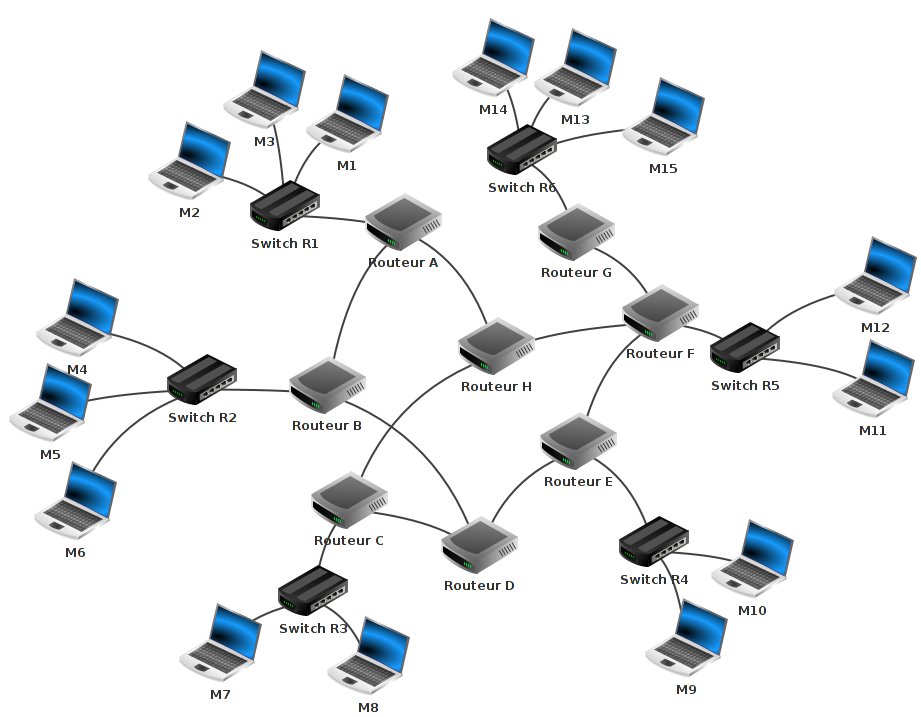

---
tags:
  - snt/internet
hide :
  - feedback
---
# Simuler un réseau

 
!!! info "Consignes[^1]"  

	L'application Filius n'est pas installée sur nos machines.
	
	- Télécharger le fichier [:fontawesome-regular-file:.zip](https://www.lernsoftware-filius.de/downloads/Setup/filius-2.5.1.zip){ .md-button .md-button--primary  }
	- Double-click sur le fichier et dézipper dans le dossier par défaut
	- Lancer l'executable. 
	- Sélectionner la langue adaptée pour éviter de travailler en allemand. 
	
 
Il est un peu difficile de mettre en place un réseau pour effectuer quelques tests. À la place nous allons utiliser un simulateur de réseau relativement simple à prendre en main, mais suffisamment performant : **Filius**.
 
!!! info "à faire"
	Avant de visionner une petite vidéo qui devrait vous aider à prendre en main Filius, quelques petites indications

	Nous allons utiliser deux commandes dans la vidéo :
	
	- ```ipconfig``` qui permet de connaitre la configuration réseau de la machine sur laquelle est exécutée cette commande (```ipconfig``` est une véritable commande sous Windows de Microsoft, sous les systèmes de type Unix (Linux ou macOS par exemple), la commande équivalente est ```ifconfig```)
	- ```ping``` qui permet d'envoyer des paquets de données d'une machine A vers une machine B. Si la commande est exécutée sur la machine A, le ```ping``` devra être suivi par l'adresse IP de la machine B (par exemple, si l'adresse IP de B est ```192.168.0.2```, on aura ```ping 192.168.0.2```)

	Autre chose à retenir, vous allez apercevoir dans cette vidéo un ```netmask``` (masque de réseau en français), vous devez juste savoir que :

	- pour une adresse IP qui se termine par /8, on a un netmask qui est ```255.0.0.0```
	- pour une adresse IP qui se termine par /16, on a un netmask qui est ```255.255.0.0```
	- pour une adresse IP qui se termine par /24, on a un netmask qui est ```255.255.255.0```
 
	Vous pouvez maintenant visionner la vidéo (n'hésitez pas à mettre en plein écran pour un meilleur confort de lecture).
 
	<iframe  width="100%" height="416px" src="https://www.youtube.com/embed/nzuRSOwdF5I?rel=0&showinfo=0" frameborder="0" allow="accelerometer; autoplay; clipboard-write; encrypted-media; gyroscope; picture-in-picture" allowfullscreen></iframe>  


???+ question "Étape 1"  

	1. En utilisant le logiciel Filius, créez un réseau de 4 machines (M1, M2, M3 et M4). L'adresse IP de la machine M1 est ```192.168.1.1/24```, choisissez les adresses IP des machines M2, M3 et M4.
	1. Effectuez un ```ping``` de la machine M2 vers la machine M4.
 
!!! info "à faire"
	Dans la vidéo suivante, nous allons utiliser la commande ```traceroute``` qui permet de suivre le chemin qu'un paquet de données va suivre pour aller d'une machine à l'autre.
	
	N'hésitez pas à mettre en plein écran pour un meilleur confort de lecture.
	
	<iframe  width="100%" height="416px" src="https://www.youtube.com/embed/xyK6ThdQeR0?rel=0&showinfo=0" frameborder="0" allow="accelerometer; autoplay; clipboard-write; encrypted-media; gyroscope; picture-in-picture" allowfullscreen></iframe>   


???+ question "Étape 2"  

	En utilisant le logiciel Filius
	
	- créez 3 réseaux de 2 machines chacun. 
	- relier les 3 réseaux par un routeur. 

	Après avoir effectué toutes les opérations de configuration nécessaires, effectuez un ```ping``` entre deux machines de deux réseaux différents.
 
???+ question "Étape 3"  

	Nous allons maintenant travailler sur un réseau plus complexe :

	
 
	1. À l'aide du logiciel Filius, ouvrez le fichier [```snt_sim_res.fls```](pathname:///snt/snt_sim_res.fls).
	1. Faites un ```traceroute``` entre l'ordinateur M14 et l'ordinateur M9 (n'oubliez pas de faire un ```ipconfig``` sur la machine M9 afin d'obtenir son adresse IP). Notez le chemin parcouru pour aller de la machine M14 à la machine M9.
	1.  Supprimez le câble réseau qui relie le routeur F au routeur E (simulation de panne), refaites un ```traceroute``` entre M14 et M9. Que constatez-vous ? 

	!!! info "Indications"
		Cela peut ne pas fonctionner du premier coup, car la mise à jour des tables de routage n'est pas immédiate : vous pouvez essayer de faire un ping entre M14 et M9, si cela ne fonctionne pas (```timeout```), attendez quelques secondes et recommencez. Une fois que le ```ping``` fonctionne, vous pouvez faire le ```traceroute```).
 

???+ question "Étape 4  : configurer un serveur DNS" 

	En vous aidant de la vidéo ci-dessous, modifiez l'architecture réseau proposée dans le fichier [```snt_sim_dns.fls```](pathname:///snt/snt_sim_dns.fls) (fichier à ouvrir depuis le logiciel Filius), afin que la machine M5 réponde à la commande ```ping M5``` **exécutée depuis l'ordinateur M2**.
	 
	 
	<iframe  width="100%" height="416px" src="https://www.youtube.com/embed/K3GGmiLwB6U?rel=0&showinfo=0" frameborder="0" allow="accelerometer; autoplay; clipboard-write; encrypted-media; gyroscope; picture-in-picture" allowfullscreen></iframe>

## Références
 
[^1]: TP proposé par [**David Roche**](https://pixees.fr/informatiquelycee/n_site/snt_internet_sim1.html)