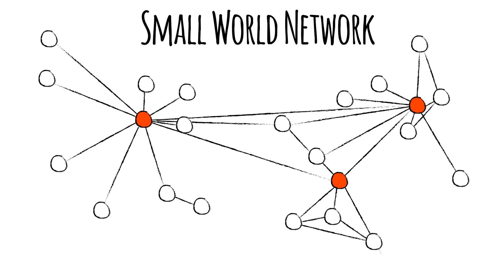

---
tags:
  - snt/reseaux sociaux
hide :
  - feedback
---
# Les Réseaux Sociaux

 
## Définition et exemples

**Réseau social** Selon [Wikipédia](https://fr.wikipedia.org/wiki/R%C3%A9seau_social), l'expression réseau social désigne en science humaines un ensemble de liens entre des individus et/ou des organisations (des **entités sociales**), constituant un groupement qui a un sens : la famille, les collègues, un groupe d'amis, une communauté.

!!! example "Exemples de réseaux sociaux"

	- Une famille et les liens de parenté
	- Une classe et les liens entre les élèves : &laquo; être amis de &raquo; 
	- Une population et les liens orientés &laquo; être fan de &raquo; (un artiste, équipe de foot)


Avec l'apparition d'internet, l'expression **Réseaux sociaux** désigne couramment les **services de réseautage social en ligne** : c'est l'ensemble des moyens virtuels mis en oeuvre pour relier des entités sociales.
 
!!! example "Exemples"

	- :material-facebook: Facebook littéralement trombinoscope, au départ un réseau social universitaire devenu en l'espace de 7 ans un outil important dans le printemps arabe. Dispose d'un outil nommé **Social graph** qui représente tout types de liens entre entités.  

	
	- :material-linkedin: LinkedIn : réseau social d'employés entre entreprises.

## Caractéristiques

Un internaute est amené à fournir des données personnelles lors de son inscription et la création d'un identifiant.  
Les fonctionnalités sont :

- sites accessibles depuis différentes plateformes (<i class="fas fa-laptop"></i> ordinateurs, <i class="fas fa-mobile-alt"></i> mobile, <i class="fab fa-xbox"></i> consoles)
- partage de différents types de contenu :
	- texte : <i class="fab fa-wordpress"></i> Wordpress, <i class="fab fa-tumblr"></i> tumblr, <i class="fab fa-blogger"></i> blogger
	- forums : <i class="fab fa-reddit"></i> reddit, <i class="fab fa-steam-symbol"></i> steam 
	- microblogging : <i class="fab fa-twitter"></i> Twitter, <i class="fab fa-weibo"></i> sina Weibo
	- Images : <i class="fab fa-instagram"></i> Instagram, <i class="fab fa-snapchat"></i> Snapchat,
	- Son : <i class="fab fa-soundcloud"></i> Soundcloud, 
	- Vidéos : <i class="fab fa-youtube"></i> Youtube, <i class="fab fa-periscope"></i> Périscope, <i class="fab fa-twitch"></i> twitch
	- Avis : <i class="fab fa-tripadvisor"></i> Tripadvisor
- contenu public, ou restreint. Éphémère ou persistant.
- Possibilité d'interactions avec des <i class="far fa-comments"></i> commentaires, <i class="fas fa-share-alt-square"></i> partages, <i class="far fa-heart"></i> likes...

L'utilisation des réseaux sociaux laisse des traces qui constituent notre **identité numérique**. Elles façonnent l'image que les autres se font de nous : &laquo; notre **e-réputation** &raquo;. Le paramétrage de ses comptes et la sécurité de son identification et authentification visent à protéger sa e-réputation.
 
## Le modèle économique 

Tous les réseaux sociaux ont un coût de fonctionnement. De plus, les réseaux sociaux les plus connus sont gérés par des entreprises commerciales, avec des employés, des charges, et un modèle économique visant à produire des bénéfices.

Les côuts de fonctionnement sont : 
	
- les serveurs, l'électricité pour les faire tourner, un loyer pour les entreposer, un accès à internet pour les connecter aux utilisateurs et utilisatrices
- des employés (techniciens pour faire fonctionner les serveurs, informaticiens pour programmer le réseau social, designers pour l'aspect du réseau social, commerciaux pour vendre le produit).

Le modèle économique peut reposer sur un ou plusieurs parmi :

- **ciblage publicitaire** : elle peut être *ciblée* en fonction du profil de l’utilisateur et *sponsorisée* pour être mise en avant. 
- **l'exploitation des données des utilisateurs** : afin d'optimiser le ciblage publicitaire. 
- le modèle **fremium** qui combine un accès de base gratuit et un abonnement **premium** proposant des fonctionnalités supplémentaires.
 
	
## Modélisation d'un réseau social par un graphe

Pour représenter un réseau social on utilise un graphe défini par :

- **sommets** : modélisent les entités sociales (utilisateurs)
- **arêtes** : modélisent les relations non orientées entre les entités
- **arcs** : modélisent une relation orientée d'une personne ou entité vers une autre.

!!! example "Exemple de graphe non orienté"

	Sur le réseau Facebook, pour être en relation, deux personnes inscrites doivent sʼaccepter mutuellement comme amis. Une arête entre 2 sommets représente la relation &laquo; sont amis &raquo;.


	```mermaid
	graph LR;
		Jade --- Julien;
		Tony --- Julien;
		Tony --- Nina;
		Nina --- Julien;
		Fred --- Tony;
		Fred --- Jade;
	```


!!! example "Exemple de graphe orienté"

	Sur Twitter, il est possible de suivre une personne inscrite sans que cela soit réciproque. Un arc entre 2 sommets représente la relation &laquo; est un abonnés de &raquo;. 

	```mermaid  
	graph LR; 
		Jade --> Julien;
		Julien --> Jade;
		Julien --> Tony;
		Nina --> Tony;
		Nina --> Julien;
		Julien --> Nina;
		Fred --> Tony;
		Jade --> Fred; 
	```

!!! coeur "Vocabulaire pour les graphes non orientés" 
	- **chaîne** : suite de sommets reliés par des arêtes**
	- **distance entre deux sommet**  est égale à la longueur de la plus petite chaîne qui les relie.
	- **écartement/éxcentricité d'un sommet** est la distance maximale entre ce sommet  et les autres nœuds du graphe
	- **le centre** est **l'ensemble** des sommets d'écartement minimal.
	- **diamètre du graphe** est la distance maximale entre deux sommet de ce graphe.
	- **tableau d'adjacence** est un tableau à double entrée ou chaque case contient 1 si les sommets sont liés par une arête, 0 sinon.  

!!! example "Exemple"  

	Soit le graphe et son tableau d'adjacence et celui des distances entre sommets :
	 
	 
	```mermaid
	graph LR;
		A---C;
		C---E;
		A---D;
		B---D; 
		C---B; 
		E---D;
		A---E;
	``` 
	 

	=== "Tableau d'adjacence"

		| Adjacence | A | B | C | D | E |  
		| :---: | :---: | :---: | :---: | :---: | :---:|  
		| A | 0 | 0 | 1 | 1 | 1 |  
		| B | 0 | 0 | 1 | 1 | 0 |  
		| C | 1 | 1 | 0 | 1 | 1 |  
		| D | 1 | 1 | 1 | 0 | 1 |  
		| E | 1 | 0 | 1 | 1 | 0 | 
	 

	=== "Tableau de distance"

		| Distance | A | B | C | D | E |  
		| :---: | :---: | :---: | :---: | :---: | :---: |  
		| A | 0 | 2 | 1 | 1 | 1 |  
		| B | 2 | 0 | 1 | 1 | 2 |  
		| C | 1 | 1 | 0 | 1 | 1 |  
		| D | 1 | 1 | 1 | 0 | 1 |  
		| E | 1 | 2 | 1 | 1 | 0 | 
		
	- le sommet A est adjacent à C, D et E.
	- la distance du sommet A au sommet B est de 2
	- la distance du sommet C au sommet B est de 1. B et C sont adjacents.
	- la distance du sommet C aux sommets A, B, D et E est de 1. Le sommet a un écartement de 1.
	- l'écartement du sommet D est de 1.
	- l'ensemble des sommets $\{ C; D\}$ est le centre du graphe.

   
## Propriétés observées des réseaux sociaux 

### Les chemins cours  

Le **phénomène du petit monde** est l'hypothèse selon laquelle chacun puisse être relié à n'importe quel autre individu par une courte chaîne de relations sociales. Elle fut formulée par Karinthy Frigyes en 1929.

En supposant les relations sociales soient purement aléatoires, le mathématicien Erdös(1913-1996) a observé qu'en théorie la distance moyenne entre 2 sommets du réseaux reste petite et ne dépend presque pas de la taille du réseau. 

L'expérience de Milgram laquo; petit monde &raquo; (1967) est la première tentative expérimentale de quantifier les degrés de séparation dans un réseau social et de vérifier cette propriété théorique. 

D'autres expériences viendront quantifier l'effet des réseaux sociaux sur la réduction de ce degré de séparation entre entités.

### Le regroupements en sous-communautés

La réalité reste plus complexe que le modèle de relations sociales aléatoires d'Erdös. Les réseaux sociaux réels s'organisent par regroupements le long de caractéristiques communes : goûts, opinions politiques, diplomes, écoles, éthniques, linguistiques, religieuses...

<figure markdown="span">
  
  <figcaption markdown>Modèle du petit monde [(source)](https://ket.org/program/nova/the-pattern-in-natures-networks/)</figcaption>
</figure>
  
Les algorithmes utilisés par les réseaux sociaux pour recommander du contenu (ou des entités à suivre) peuvent renforcer le phénomène de **chambre d'écho** (de cloisonnement) et à l'**appauvrissement de la pensée critique**.  

### Les pôles (Hubs)

Dans les réseaux sociaux réels, on voit apparaitre des noeuds avec beaucoup d'interconnexions, qui jouent le rôle de lien entre les différentes sous-communautés. 

 
## Les Infox

Les _faits alternatifs_ sont un mélange de :

- la **mésinformation** : information fausse mais ceux qui la partagent ne s'en rendent pas compte
- la **désinformation** : information fausse mais ceux qui la partagent en sont conscients
- mensonges partiels : faits et documents donnés hors contexte, choix biaisés des données.

Les utilisateurs des réseaux sociaux participent à une **collecte d'information passive** qui est influencée par :

- les acteurs influent des réseaux sociaux, qui cherchent à capter l’attention et gagner en visibilité. Ils peuvent sacrifier la rigueur et le contexte d'une information au profit d'une présentation plus divertissante, plus brève (clip de 15s) ou plus choquante. 
- des algorithmes mis en place par les plateformes des réseaux sociaux qui visent aussi à capter l'attention pour revendre de la publicité.


## La Cyberviolence

La **cyberviolence** regroupe toues les violences commises à l’aide d’outils de communication numérique. Dans le cas d’actes **répétés** de cyberviolence, on parle de **cyberharcèlement**.  
 
Depuis 2014, il existe un délit spécifique au harcèlement sur internet [(article 222-3-2 du Code pénal)](https://www.legifrance.gouv.fr/affichCodeArticle.do?idArticle=LEGIARTI000026268205&cidTexte=LEGITEXT000006070719). qui a été [renforcé en 2018](https://www.legifrance.gouv.fr/affichCodeArticle.do;jsessionid=A38CEE7B149F44AD3E45C5FE3BDD8171.tplgfr38s_2?idArticle=LEGIARTI000037289658&cidTexte=LEGITEXT000006070719&dateTexte=20180920&categorieLien=id&oldAction=&nbResultRech=)
Les sanctions pénales peuvent atteindre 3 ans de prison et 45 000 € d’amende.
 